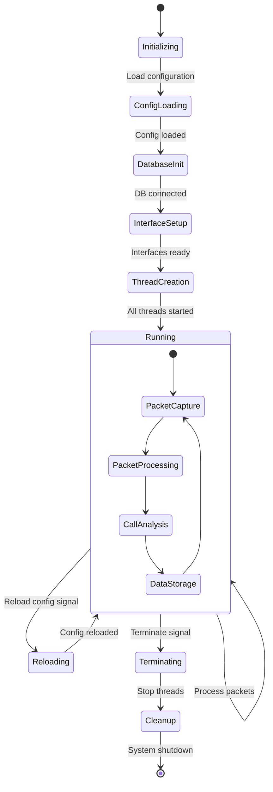

# Main System Module State Diagram (voipmonitor.cpp)

## Overview
The Main System Module is the core orchestrator of the VoipMonitor system, responsible for system initialization, configuration management, thread coordination, and overall system lifecycle management.

## State Diagram

## State Descriptions

### Initializing
- **Purpose**: System startup and basic initialization
- **Activities**: 
  - Initialize global variables
  - Set up signal handlers
  - Allocate basic resources
- **Exit Conditions**: Basic initialization complete

### ConfigLoading
- **Purpose**: Load and parse configuration files
- **Activities**:
  - Read configuration from files
  - Parse command line arguments
  - Validate configuration parameters
- **Exit Conditions**: Configuration successfully loaded

### DatabaseInit
- **Purpose**: Initialize database connections
- **Activities**:
  - Connect to MySQL database
  - Verify database schema
  - Initialize connection pools
- **Exit Conditions**: Database connectivity established

### InterfaceSetup
- **Purpose**: Initialize network interfaces for packet capture
- **Activities**:
  - Open network interfaces
  - Set capture filters
  - Configure packet buffers
- **Exit Conditions**: All interfaces ready for capture

### ThreadCreation
- **Purpose**: Start all processing threads
- **Activities**:
  - Create packet processing threads
  - Start RTP analysis threads
  - Initialize worker thread pools
- **Exit Conditions**: All threads successfully started

### Running
- **Purpose**: Main operational state
- **Activities**:
  - Continuous packet processing
  - Call monitoring and analysis
  - Data storage operations
  - Status monitoring
- **Nested States**:
  - **PacketCapture**: Capture network packets
  - **PacketProcessing**: Process captured packets
  - **CallAnalysis**: Analyze SIP calls and RTP streams
  - **DataStorage**: Store processed data to database

### Reloading
- **Purpose**: Dynamic configuration reload
- **Activities**:
  - Re-read configuration files
  - Apply new settings
  - Notify modules of changes
- **Exit Conditions**: Configuration successfully reloaded

### Terminating
- **Purpose**: Graceful system shutdown initiation
- **Activities**:
  - Signal all threads to stop
  - Wait for threads to complete
  - Begin resource cleanup
- **Exit Conditions**: All threads signaled to terminate

### Cleanup
- **Purpose**: Final resource cleanup and shutdown
- **Activities**:
  - Close network interfaces
  - Disconnect from database
  - Free allocated memory
  - Close log files
- **Exit Conditions**: All resources cleaned up

## Key Transitions

1. **Startup Sequence**: Initializing → ConfigLoading → DatabaseInit → InterfaceSetup → ThreadCreation → Running
2. **Runtime Operation**: Running ↔ Running (continuous operation)
3. **Configuration Reload**: Running → Reloading → Running
4. **Shutdown Sequence**: Running → Terminating → Cleanup → [End]

## Error Handling

- Configuration errors may cause restart with default settings
- Database connection failures trigger reconnection attempts
- Interface failures may cause fallback to alternative interfaces
- Thread creation failures result in system shutdown

## Dependencies

- Configuration Module for settings management
- Database Module for data persistence
- Packet Capture Module for network interface management
- All other modules depend on this module for coordination