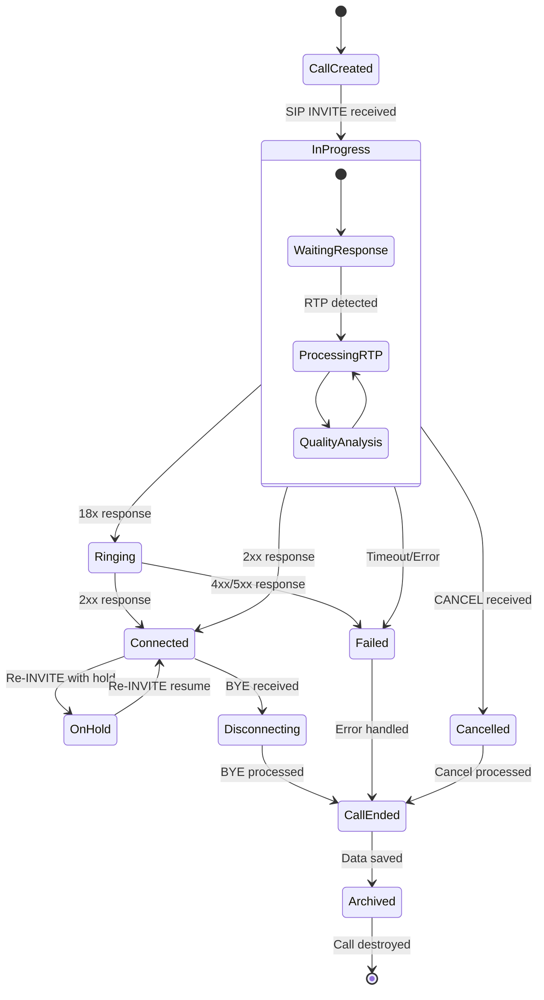

# Call Table Module State Diagram (calltable.h/cpp)

## Overview
The Call Table Module is the central coordinator for SIP call management, maintaining call states, managing RTP streams, and coordinating with other modules for comprehensive call analysis.

## State Diagram

## State Descriptions

### CallCreated
- **Purpose**: Initial call object creation
- **Activities**:
  - Allocate call structure
  - Initialize call parameters
  - Set up call identifier
  - Create call branches
- **Triggers**: SIP INVITE packet received
- **Exit Conditions**: Call object fully initialized

### InProgress
- **Purpose**: Call establishment phase
- **Activities**:
  - Process SIP signaling messages
  - Handle authentication challenges
  - Manage call routing
  - Monitor for RTP streams
- **Nested States**:
  - **WaitingResponse**: Waiting for SIP responses
  - **ProcessingRTP**: Processing media streams
  - **QualityAnalysis**: Analyzing call quality metrics
- **Exit Conditions**: Call answered, cancelled, or failed

### Ringing
- **Purpose**: Call alerting phase
- **Activities**:
  - Process 18x responses (Ringing, Session Progress)
  - Handle early media if present
  - Monitor for call pickup or rejection
  - Track ring duration
- **Entry Conditions**: 18x SIP response received
- **Exit Conditions**: Call answered (2xx) or rejected (4xx/5xx)

### Connected
- **Purpose**: Active call state
- **Activities**:
  - Process bidirectional RTP streams
  - Monitor call quality metrics
  - Handle mid-call changes (hold/resume)
  - Process re-INVITEs
  - Track call duration
- **Entry Conditions**: 2xx SIP response received
- **Exit Conditions**: BYE received or call failure

### OnHold
- **Purpose**: Call hold state
- **Activities**:
  - Monitor hold music/silence
  - Process hold-related SIP messages
  - Maintain call context
  - Wait for resume signal
- **Entry Conditions**: Re-INVITE with hold attributes
- **Exit Conditions**: Re-INVITE to resume call

### Disconnecting
- **Purpose**: Call termination phase
- **Activities**:
  - Process BYE messages
  - Handle final SIP exchanges
  - Complete RTP stream analysis
  - Prepare final call statistics
- **Entry Conditions**: BYE message received
- **Exit Conditions**: Call termination complete

### Cancelled
- **Purpose**: Call cancellation handling
- **Activities**:
  - Process CANCEL messages
  - Clean up partial call setup
  - Generate cancellation statistics
- **Entry Conditions**: CANCEL message received
- **Exit Conditions**: Cancellation processing complete

### Failed
- **Purpose**: Call failure handling
- **Activities**:
  - Process error responses (4xx/5xx)
  - Analyze failure reasons
  - Generate failure statistics
  - Clean up call resources
- **Entry Conditions**: SIP error response or timeout
- **Exit Conditions**: Failure processing complete

### CallEnded
- **Purpose**: Call completion processing
- **Activities**:
  - Finalize call statistics
  - Calculate quality metrics
  - Prepare data for storage
  - Generate CDR (Call Detail Record)
- **Entry Conditions**: Call terminated by any means
- **Exit Conditions**: All call data processed

### Archived
- **Purpose**: Call data persistence
- **Activities**:
  - Store call data to database
  - Archive audio recordings if enabled
  - Update statistics tables
  - Clean up temporary data
- **Entry Conditions**: Call data ready for storage
- **Exit Conditions**: All data successfully stored

## Key SIP Methods Handled

- **INVITE**: Call initiation and modification
- **ACK**: Call establishment confirmation
- **BYE**: Call termination
- **CANCEL**: Call cancellation
- **REGISTER**: User registration (handled by Registration Module)
- **OPTIONS**: Capability negotiation
- **INFO**: Mid-call information
- **UPDATE**: Session parameter updates

## RTP Stream Management

During the **Connected** and **InProgress** states, the module:
- Detects RTP streams based on SDP information
- Creates RTP processing objects
- Monitors stream quality
- Handles DTMF detection
- Manages codec changes

## Quality Metrics Tracked

- **MOS (Mean Opinion Score)**: Voice quality rating
- **Packet Loss**: Lost RTP packets percentage
- **Jitter**: Packet delay variation
- **Delay**: End-to-end packet delay
- **Call Setup Time**: Time to establish call
- **Call Duration**: Total call time

## Error Handling

- **Timeout Handling**: Calls that don't progress within time limits
- **SIP Error Responses**: 4xx/5xx response processing
- **Network Issues**: Packet loss and connectivity problems
- **Codec Issues**: Unsupported or problematic codecs

## Dependencies

- **RTP Module**: For media stream processing
- **Database Module**: For call data storage
- **Billing Module**: For call charging
- **Registration Module**: For user authentication
- **Country Detection**: For geographic analysis