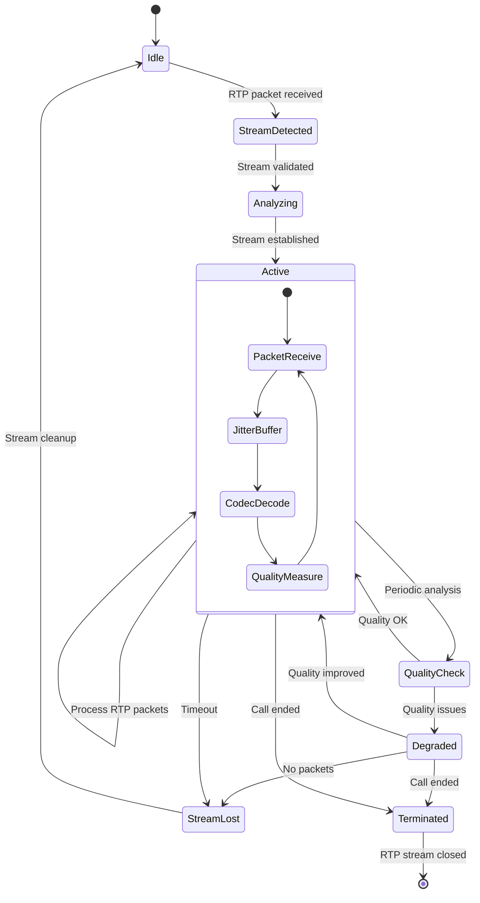

# RTP Processing Module State Diagram (rtp.h/cpp)

## Overview
The RTP Processing Module handles real-time media stream analysis, quality measurement, and audio processing for VoIP calls. It manages jitter buffers, codec decoding, and quality metrics calculation.

## State Diagram

## State Descriptions

### Idle
- **Purpose**: Waiting for RTP stream initiation
- **Activities**:
  - Monitor for incoming RTP packets
  - Maintain minimal resource allocation
  - Ready to process new streams
- **Entry Conditions**: No active RTP stream
- **Exit Conditions**: First RTP packet received

### StreamDetected
- **Purpose**: Initial RTP stream validation
- **Activities**:
  - Validate RTP header format
  - Check payload type
  - Verify SSRC consistency
  - Initialize stream parameters
- **Entry Conditions**: RTP packet received
- **Exit Conditions**: Stream validation complete

### Analyzing
- **Purpose**: Stream establishment and parameter detection
- **Activities**:
  - Determine codec type from payload
  - Establish timing parameters
  - Initialize jitter buffer
  - Set up quality measurement baseline
- **Entry Conditions**: Valid RTP stream detected
- **Exit Conditions**: Stream parameters established

### Active
- **Purpose**: Normal RTP stream processing
- **Activities**:
  - Process incoming RTP packets
  - Maintain jitter buffer
  - Decode audio payload
  - Calculate real-time quality metrics
  - Handle sequence number gaps
- **Nested States**:
  - **PacketReceive**: Accept and validate RTP packets
  - **JitterBuffer**: Manage packet timing and ordering
  - **CodecDecode**: Decode audio payload
  - **QualityMeasure**: Calculate quality metrics
- **Entry Conditions**: Stream established successfully
- **Exit Conditions**: Quality issues, timeout, or call end

### QualityCheck
- **Purpose**: Periodic quality assessment
- **Activities**:
  - Analyze packet loss patterns
  - Calculate MOS scores
  - Evaluate jitter levels
  - Check for codec issues
  - Generate quality reports
- **Entry Conditions**: Periodic timer or quality threshold
- **Exit Conditions**: Quality assessment complete

### Degraded
- **Purpose**: Poor quality stream handling
- **Activities**:
  - Apply error concealment
  - Increase buffer size if needed
  - Log quality issues
  - Attempt quality recovery
  - Monitor for improvement
- **Entry Conditions**: Quality metrics below threshold
- **Exit Conditions**: Quality improved or stream lost

### StreamLost
- **Purpose**: Handle lost RTP stream
- **Activities**:
  - Detect stream interruption
  - Wait for stream recovery
  - Clean up partial data
  - Generate loss reports
- **Entry Conditions**: No packets received within timeout
- **Exit Conditions**: Stream recovery or cleanup complete

### Terminated
- **Purpose**: Clean RTP stream termination
- **Activities**:
  - Finalize quality calculations
  - Generate final statistics
  - Clean up buffers and resources
  - Prepare data for storage
- **Entry Conditions**: Call ended or explicit termination
- **Exit Conditions**: All cleanup complete

## RTP Packet Processing Details

### Packet Validation
- **Version Check**: Ensure RTP version 2
- **Payload Type**: Validate against expected codec
- **Sequence Number**: Check for gaps and duplicates
- **Timestamp**: Verify timing consistency
- **SSRC**: Confirm source identifier

### Jitter Buffer Management
- **Adaptive Sizing**: Adjust buffer size based on network conditions
- **Packet Ordering**: Reorder out-of-sequence packets
- **Late Packet Handling**: Decide whether to use or discard late packets
- **Underrun/Overrun**: Handle buffer starvation or overflow

### Codec Support
- **G.711 (PCMU/PCMA)**: Standard telephony codecs
- **G.722**: Wideband audio codec
- **G.729**: Compressed audio codec
- **iLBC**: Internet Low Bitrate Codec
- **Opus**: Modern audio codec
- **Dynamic Payload Types**: Handle negotiated codecs

### Quality Metrics Calculated

#### Real-time Metrics
- **Packet Loss Rate**: Percentage of lost packets
- **Jitter**: Packet delay variation (RFC 3550)
- **Delay**: End-to-end packet delay
- **Burst Loss**: Consecutive packet losses

#### Perceptual Quality Metrics
- **MOS (Mean Opinion Score)**: Overall quality rating (1-5 scale)
- **R-Factor**: ITU-T G.107 quality metric
- **PESQ**: Perceptual Evaluation of Speech Quality
- **Silence Detection**: Periods of no audio activity

#### Advanced Metrics
- **Clipping Detection**: Audio amplitude limiting
- **Echo Detection**: Acoustic echo presence
- **Noise Level**: Background noise measurement
- **Frequency Analysis**: Spectral content analysis

## DTMF Detection

The module includes DTMF (Dual-Tone Multi-Frequency) detection:
- **In-band DTMF**: Detected from audio stream
- **RFC 2833 Events**: Out-of-band DTMF signaling
- **SIP INFO**: DTMF via SIP INFO messages

## Error Handling

### Packet Loss Recovery
- **Forward Error Correction**: Use redundant data if available
- **Interpolation**: Generate replacement audio
- **Silence Insertion**: Insert silence for lost packets

### Clock Skew Compensation
- **Timestamp Analysis**: Detect sender clock drift
- **Rate Adjustment**: Compensate for timing differences
- **Buffer Adaptation**: Adjust jitter buffer accordingly

### Codec Issues
- **Unsupported Codecs**: Handle unknown payload types
- **Codec Changes**: Adapt to mid-call codec switches
- **Decoding Errors**: Handle corrupted audio data

## Performance Optimization

- **Multi-threading**: Parallel processing of multiple streams
- **Memory Pooling**: Efficient buffer management
- **SIMD Instructions**: Optimized audio processing
- **Lock-free Queues**: High-performance packet handling

## Dependencies

- **Call Table Module**: For call context and state
- **Audio/DSP Module**: For advanced audio processing
- **Database Module**: For quality metric storage
- **Configuration Module**: For codec and buffer settings