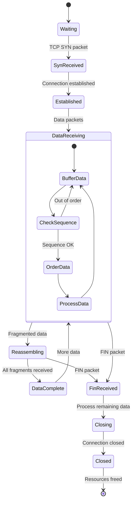

# TCP Reassembly Module State Diagram (tcpreassembly.h/cpp)

## Overview
The TCP Reassembly Module handles TCP stream reconstruction from individual packets, managing out-of-order delivery, fragmentation, and providing complete data streams to upper-layer protocols like SIP and HTTP.

## State Diagram

## State Descriptions

### Waiting
- **Purpose**: Idle state waiting for new TCP connections
- **Activities**:
  - Monitor for TCP SYN packets
  - Maintain connection table
  - Clean up expired connections
- **Entry Conditions**: No active connections or new connection needed
- **Exit Conditions**: TCP SYN packet detected

### SynReceived
- **Purpose**: TCP connection establishment phase
- **Activities**:
  - Process SYN packet
  - Create connection tracking structure
  - Initialize sequence numbers
  - Set up reassembly buffers
  - Handle SYN-ACK exchange
- **Entry Conditions**: TCP SYN packet received
- **Exit Conditions**: Three-way handshake complete

### Established
- **Purpose**: TCP connection ready for data transfer
- **Activities**:
  - Monitor for data packets
  - Initialize flow tracking
  - Set up bidirectional buffers
  - Prepare for data reassembly
- **Entry Conditions**: TCP handshake completed
- **Exit Conditions**: First data packet received

### DataReceiving
- **Purpose**: Active data packet processing
- **Activities**:
  - Receive TCP data packets
  - Buffer incoming data
  - Check sequence numbers
  - Handle retransmissions
  - Manage flow control
- **Nested States**:
  - **BufferData**: Store incoming packet data
  - **CheckSequence**: Validate packet ordering
  - **OrderData**: Arrange packets in correct sequence
  - **ProcessData**: Extract application data
- **Entry Conditions**: Data packets arriving
- **Exit Conditions**: Connection closing or fragmentation detected

### Reassembling
- **Purpose**: Handle fragmented or out-of-order data
- **Activities**:
  - Sort packets by sequence number
  - Fill gaps in data stream
  - Handle overlapping segments
  - Detect missing segments
  - Manage reassembly timers
- **Entry Conditions**: Out-of-order or fragmented data detected
- **Exit Conditions**: All fragments received or timeout

### DataComplete
- **Purpose**: Complete data ready for upper layer
- **Activities**:
  - Validate complete data stream
  - Perform final ordering check
  - Prepare data for application layer
  - Notify upper layer protocols
  - Clear reassembly buffers
- **Entry Conditions**: All expected data received
- **Exit Conditions**: Data delivered to upper layer

### FinReceived
- **Purpose**: Handle connection termination initiation
- **Activities**:
  - Process FIN packet
  - Handle remaining data in buffers
  - Prepare for connection closure
  - Send final ACK if needed
- **Entry Conditions**: TCP FIN packet received
- **Exit Conditions**: Connection termination sequence started

### Closing
- **Purpose**: Connection termination processing
- **Activities**:
  - Process remaining buffered data
  - Handle final packet exchanges
  - Complete data delivery
  - Prepare for resource cleanup
- **Entry Conditions**: Connection termination in progress
- **Exit Conditions**: All data processed and connection closed

### Closed
- **Purpose**: Clean up connection resources
- **Activities**:
  - Free reassembly buffers
  - Remove connection from tracking table
  - Generate connection statistics
  - Log connection summary
- **Entry Conditions**: Connection fully closed
- **Exit Conditions**: All resources freed

## TCP Stream Processing Details

### Sequence Number Management
- **Initial Sequence Numbers**: Track ISN from SYN packets
- **Sequence Validation**: Ensure packets are within expected window
- **Gap Detection**: Identify missing sequence ranges
- **Duplicate Handling**: Detect and discard duplicate packets

### Buffer Management
- **Per-Direction Buffers**: Separate buffers for each flow direction
- **Dynamic Sizing**: Adjust buffer size based on data volume
- **Memory Limits**: Prevent excessive memory usage
- **Garbage Collection**: Clean up old or unused buffers

### Out-of-Order Handling
- **Reordering Buffer**: Temporary storage for out-of-order packets
- **Insertion Sort**: Maintain packets in sequence order
- **Gap Tracking**: Monitor missing sequence ranges
- **Timeout Handling**: Handle permanently lost packets

### Fragmentation Support
- **IP Fragmentation**: Handle fragmented IP packets
- **TCP Segmentation**: Reassemble segmented TCP data
- **Maximum Segment Size**: Respect MSS negotiation
- **Fragment Overlap**: Handle overlapping fragments

## Protocol Support

### SIP over TCP
- **Message Boundaries**: Detect complete SIP messages
- **Content-Length**: Use header to determine message size
- **Pipelining**: Handle multiple messages in single connection
- **Keep-Alive**: Manage persistent connections

### HTTP/HTTPS
- **Request/Response Pairs**: Match requests with responses
- **Chunked Encoding**: Handle chunked transfer encoding
- **Persistent Connections**: Support HTTP/1.1 keep-alive
- **WebSocket Upgrade**: Handle protocol upgrades

### SSL/TLS
- **Handshake Reassembly**: Complete SSL handshake messages
- **Record Boundaries**: Identify SSL record boundaries
- **Alert Messages**: Handle SSL alert messages
- **Application Data**: Reassemble encrypted application data

## Performance Optimizations

### Memory Management
- **Object Pooling**: Reuse connection objects
- **Buffer Pools**: Pre-allocated buffer management
- **Memory Mapping**: Efficient large buffer handling
- **Lazy Allocation**: Allocate resources only when needed

### Processing Efficiency
- **Hash Tables**: Fast connection lookup
- **Sorted Lists**: Efficient sequence number management
- **Batch Processing**: Process multiple packets together
- **Lock-Free Structures**: Reduce synchronization overhead

### Resource Limits
- **Connection Limits**: Maximum concurrent connections
- **Memory Limits**: Per-connection memory caps
- **Timeout Values**: Configurable timeout parameters
- **Rate Limiting**: Prevent resource exhaustion

## Error Handling

### Connection Errors
- **RST Packets**: Handle connection resets
- **Timeout Conditions**: Deal with stalled connections
- **Malformed Packets**: Handle invalid TCP packets
- **Checksum Errors**: Detect and handle corrupted packets

### Reassembly Errors
- **Missing Segments**: Handle permanently lost data
- **Buffer Overflow**: Prevent memory exhaustion
- **Sequence Errors**: Handle invalid sequence numbers
- **Protocol Violations**: Deal with non-compliant implementations

### Recovery Mechanisms
- **Connection Recovery**: Attempt to salvage partial data
- **Graceful Degradation**: Continue processing when possible
- **Error Reporting**: Log errors for analysis
- **Statistics Tracking**: Monitor error rates

## Configuration Parameters

- **Buffer Sizes**: Configurable reassembly buffer sizes
- **Timeout Values**: Connection and reassembly timeouts
- **Memory Limits**: Maximum memory usage per connection
- **Protocol Options**: Enable/disable specific protocol handling

## Dependencies

- **Packet Capture Module**: For raw TCP packet input
- **SSL Module**: For encrypted traffic processing
- **SIP Processing**: For SIP message handling
- **HTTP Processing**: For web traffic analysis
- **Database Module**: For connection logging