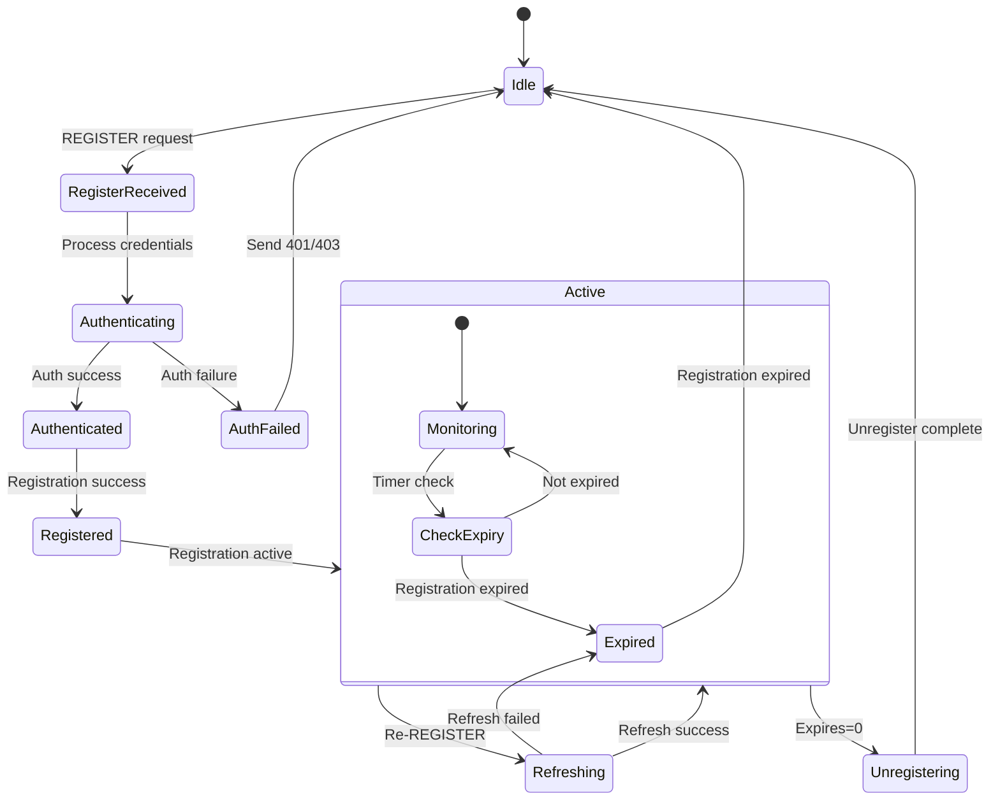

# SIP Registration Module State Diagram (register.h/cpp)

## Overview
The SIP Registration Module manages SIP user registrations, handling authentication, registration state tracking, and registration expiration management. It maintains user location information and registration status.

## State Diagram

## State Descriptions

### Idle
- **Purpose**: No active registration for this user/contact
- **Activities**:
  - Monitor for new REGISTER requests
  - Clean up expired registration data
  - Maintain registration database
- **Entry Conditions**: No registration or registration expired
- **Exit Conditions**: REGISTER request received

### RegisterReceived
- **Purpose**: Initial REGISTER request processing
- **Activities**:
  - Parse REGISTER message
  - Extract user credentials
  - Validate request format
  - Check required headers
  - Prepare authentication challenge
- **Entry Conditions**: REGISTER request received
- **Exit Conditions**: Request parsed and validated

### Authenticating
- **Purpose**: User authentication processing
- **Activities**:
  - Validate digest authentication
  - Check username/password credentials
  - Verify realm and nonce values
  - Calculate authentication response
  - Check for replay attacks
- **Entry Conditions**: Authentication credentials present
- **Exit Conditions**: Authentication result determined

### Authenticated
- **Purpose**: Successful authentication completed
- **Activities**:
  - Verify user authorization
  - Check registration permissions
  - Validate contact information
  - Prepare success response
- **Entry Conditions**: Authentication successful
- **Exit Conditions**: Authorization complete

### AuthFailed
- **Purpose**: Authentication failure handling
- **Activities**:
  - Generate authentication challenge
  - Send 401 Unauthorized or 403 Forbidden
  - Log authentication failure
  - Update failure counters
- **Entry Conditions**: Authentication failed
- **Exit Conditions**: Error response sent

### Registered
- **Purpose**: Registration successfully processed
- **Activities**:
  - Store registration information
  - Update location database
  - Set expiration timer
  - Send 200 OK response
  - Log successful registration
- **Entry Conditions**: Authentication and authorization successful
- **Exit Conditions**: Registration data stored

### Active
- **Purpose**: Registration is active and valid
- **Activities**:
  - Monitor registration expiration
  - Handle location queries
  - Process registration updates
  - Maintain contact information
- **Nested States**:
  - **Monitoring**: Continuous expiration monitoring
  - **CheckExpiry**: Periodic expiration checks
- **Entry Conditions**: Registration completed successfully
- **Exit Conditions**: Re-registration, unregistration, or expiration

### Refreshing
- **Purpose**: Registration renewal processing
- **Activities**:
  - Process re-REGISTER request
  - Update expiration time
  - Refresh contact information
  - Send refresh response
- **Entry Conditions**: Re-REGISTER request received
- **Exit Conditions**: Refresh processed successfully or failed

### Unregistering
- **Purpose**: Explicit unregistration processing
- **Activities**:
  - Process REGISTER with Expires: 0
  - Remove registration from database
  - Clean up associated data
  - Send confirmation response
- **Entry Conditions**: REGISTER with Expires: 0 received
- **Exit Conditions**: Unregistration complete

### Expired
- **Purpose**: Registration expiration handling
- **Activities**:
  - Remove expired registration
  - Clean up location data
  - Log expiration event
  - Update statistics
- **Entry Conditions**: Registration timeout reached
- **Exit Conditions**: Cleanup complete

## Registration Processing Details

### REGISTER Message Parsing
- **Request-URI**: Extract registration domain
- **To Header**: Identify user being registered
- **From Header**: Verify registering party
- **Contact Header**: Extract contact information
- **Expires Header**: Determine registration lifetime
- **Authorization Header**: Extract authentication credentials

### Authentication Methods
- **Digest Authentication**: RFC 3261 digest authentication
- **Basic Authentication**: Simple username/password (deprecated)
- **Certificate Authentication**: X.509 certificate-based auth
- **Token Authentication**: OAuth or similar token-based auth

### Contact Information Management
- **Contact URI**: SIP URI for reaching the user
- **Expires Value**: Registration lifetime in seconds
- **Q-Value**: Contact priority (for multiple contacts)
- **Parameters**: Additional contact parameters

### Registration Database
- **User Identity**: AOR (Address of Record)
- **Contact List**: All registered contacts for user
- **Expiration Times**: When each contact expires
- **Registration State**: Current state of each registration
- **Statistics**: Registration counters and metrics

## Registration States (eRegisterState)

### rs_OK (1)
- **Description**: Registration successful
- **Response Code**: 200 OK
- **Database State**: Active registration stored

### rs_Failed (2)
- **Description**: Registration failed
- **Response Codes**: 4xx/5xx errors
- **Common Causes**: Authentication failure, forbidden

### rs_UnknownMessageOK (3)
- **Description**: Successful but unrecognized message
- **Handling**: Treat as successful registration

### rs_ManyRegMessages (4)
- **Description**: Too many registration attempts
- **Handling**: Rate limiting applied

### rs_Expired (5)
- **Description**: Registration expired
- **Handling**: Remove from active registrations

### rs_Unregister (6)
- **Description**: Explicit unregistration
- **Response Code**: 200 OK
- **Database State**: Registration removed

## Error Handling

### Authentication Errors
- **401 Unauthorized**: Authentication required
- **403 Forbidden**: Authentication failed permanently
- **407 Proxy Authentication Required**: Proxy auth needed

### Registration Errors
- **400 Bad Request**: Malformed REGISTER request
- **423 Interval Too Brief**: Expires value too small
- **500 Server Internal Error**: Server processing error

### Network Errors
- **Request Timeout**: No response within timeout
- **Connection Failure**: Network connectivity issues
- **DNS Resolution**: Domain name resolution failures

## Security Features

### Replay Attack Prevention
- **Nonce Values**: Unique values for each challenge
- **Timestamp Validation**: Check request timestamps
- **Sequence Numbers**: Detect replayed requests

### Rate Limiting
- **Registration Attempts**: Limit attempts per time period
- **Source IP Limiting**: Prevent abuse from single IP
- **User Limiting**: Prevent abuse by single user

### Fraud Detection
- **Unusual Patterns**: Detect abnormal registration behavior
- **Geographic Anomalies**: Detect impossible location changes
- **Device Fingerprinting**: Track device characteristics

## Performance Considerations

### Database Optimization
- **Indexing**: Efficient database indexes for lookups
- **Connection Pooling**: Reuse database connections
- **Batch Operations**: Group database operations
- **Caching**: Cache frequently accessed registrations

### Memory Management
- **Registration Pools**: Pre-allocated registration objects
- **Garbage Collection**: Clean up expired registrations
- **Memory Limits**: Prevent memory exhaustion

### Scalability
- **Horizontal Scaling**: Distribute across multiple servers
- **Load Balancing**: Balance registration processing
- **Clustering**: Share registration state across cluster

## Configuration Parameters

- **Default Expires**: Default registration lifetime
- **Max Expires**: Maximum allowed registration lifetime
- **Min Expires**: Minimum allowed registration lifetime
- **Authentication Timeout**: Time to complete authentication
- **Cleanup Interval**: How often to clean expired registrations

## Statistics and Monitoring

### Registration Metrics
- **Active Registrations**: Current number of active registrations
- **Registration Rate**: Registrations per second
- **Success Rate**: Percentage of successful registrations
- **Failure Rate**: Percentage of failed registrations

### Performance Metrics
- **Response Time**: Average registration processing time
- **Database Performance**: Database operation timing
- **Memory Usage**: Registration data memory consumption
- **CPU Usage**: Registration processing CPU usage

## Dependencies

- **Database Module**: For registration data storage
- **Authentication Module**: For credential validation
- **Configuration Module**: For registration parameters
- **Fraud Detection**: For security monitoring
- **Statistics Module**: For metrics collection