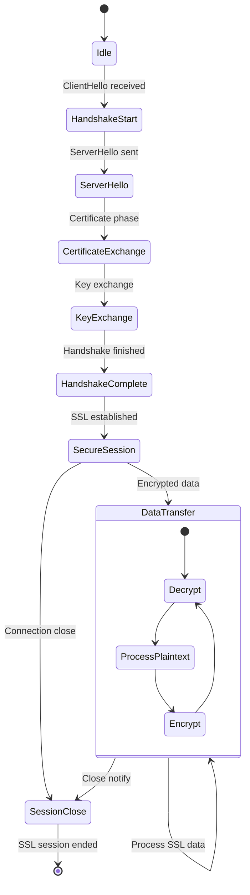

# SSL/TLS Processing Module State Diagram (ssl.h/cpp)

## Overview
The SSL/TLS Processing Module handles encrypted traffic decryption and analysis, managing SSL handshakes, certificate validation, and providing decrypted data to upper-layer protocol analyzers.

## State Diagram

## State Descriptions

### Idle
- **Purpose**: No active SSL session
- **Activities**:
  - Monitor for SSL handshake initiation
  - Clean up expired session data
  - Prepare for new connections
- **Entry Conditions**: No SSL session active
- **Exit Conditions**: ClientHello message detected

### HandshakeStart
- **Purpose**: SSL handshake initiation
- **Activities**:
  - Process ClientHello message
  - Extract supported cipher suites
  - Parse client extensions
  - Prepare server response
- **Entry Conditions**: ClientHello received
- **Exit Conditions**: ServerHello ready to send

### ServerHello
- **Purpose**: Server handshake response
- **Activities**:
  - Send ServerHello message
  - Select cipher suite and compression
  - Generate session ID
  - Set protocol version
- **Entry Conditions**: ClientHello processed
- **Exit Conditions**: ServerHello sent

### CertificateExchange
- **Purpose**: Certificate validation phase
- **Activities**:
  - Process server certificate
  - Validate certificate chain
  - Extract public key
  - Check certificate validity
- **Entry Conditions**: Certificate message received
- **Exit Conditions**: Certificate validation complete

### KeyExchange
- **Purpose**: Cryptographic key establishment
- **Activities**:
  - Process key exchange messages
  - Generate shared secrets
  - Derive encryption keys
  - Prepare for encrypted communication
- **Entry Conditions**: Certificate exchange complete
- **Exit Conditions**: Keys established

### HandshakeComplete
- **Purpose**: Handshake finalization
- **Activities**:
  - Process Finished messages
  - Verify handshake integrity
  - Activate encryption
  - Establish secure session
- **Entry Conditions**: Key exchange complete
- **Exit Conditions**: Handshake verified and complete

### SecureSession
- **Purpose**: Encrypted session established
- **Activities**:
  - Monitor for application data
  - Maintain session state
  - Handle session resumption
  - Manage encryption context
- **Entry Conditions**: Handshake complete
- **Exit Conditions**: Application data or close notify

### DataTransfer
- **Purpose**: Encrypted data processing
- **Activities**:
  - Decrypt incoming data
  - Process plaintext content
  - Encrypt outgoing data
  - Maintain encryption state
- **Nested States**:
  - **Decrypt**: Decrypt received data
  - **ProcessPlaintext**: Analyze decrypted content
  - **Encrypt**: Encrypt data for transmission
- **Entry Conditions**: Application data received
- **Exit Conditions**: Session close or error

### SessionClose
- **Purpose**: SSL session termination
- **Activities**:
  - Process close notify alerts
  - Clean up session data
  - Free encryption contexts
  - Log session statistics
- **Entry Conditions**: Close notify or connection close
- **Exit Conditions**: Session cleanup complete

## SSL/TLS Protocol Support

### Protocol Versions
- **SSLv3**: Legacy SSL version (deprecated)
- **TLS 1.0**: RFC 2246 (deprecated)
- **TLS 1.1**: RFC 4346 (deprecated)
- **TLS 1.2**: RFC 5246 (current standard)
- **TLS 1.3**: RFC 8446 (latest version)

### Cipher Suites
- **RSA**: RSA key exchange and authentication
- **ECDHE**: Elliptic Curve Diffie-Hellman Ephemeral
- **AES**: Advanced Encryption Standard
- **ChaCha20-Poly1305**: Modern authenticated encryption
- **3DES**: Triple DES (legacy)

### Certificate Handling
- **X.509 Certificates**: Standard certificate format
- **Certificate Chains**: Validate certificate hierarchy
- **Root CA Validation**: Verify against trusted roots
- **Certificate Revocation**: Check CRL/OCSP status

## Decryption Methods

### Passive Decryption
- **Pre-shared Keys**: Use known private keys
- **Session Key Extraction**: Extract keys from memory
- **Key Logging**: Use SSL key log files
- **Certificate-based**: Decrypt using server certificates

### Active Decryption
- **Man-in-the-Middle**: Intercept and re-encrypt
- **Certificate Substitution**: Replace server certificates
- **Key Injection**: Inject known keys into sessions

### Perfect Forward Secrecy Handling
- **Ephemeral Keys**: Handle temporary key exchanges
- **Key Derivation**: Derive session keys from master secret
- **Session Resumption**: Handle resumed sessions

## Certificate Validation

### Certificate Chain Validation
- **Root Certificate**: Verify against trusted root
- **Intermediate Certificates**: Validate chain links
- **Certificate Policies**: Check policy constraints
- **Name Constraints**: Verify name restrictions

### Certificate Content Validation
- **Subject Name**: Verify certificate subject
- **Subject Alternative Names**: Check SAN extensions
- **Key Usage**: Validate key usage extensions
- **Extended Key Usage**: Check EKU extensions

### Revocation Checking
- **CRL (Certificate Revocation List)**: Check revocation status
- **OCSP (Online Certificate Status Protocol)**: Real-time status
- **OCSP Stapling**: Server-provided OCSP responses

## Security Features

### Vulnerability Detection
- **Weak Cipher Suites**: Detect deprecated ciphers
- **Protocol Downgrade**: Detect version rollback attacks
- **Certificate Issues**: Identify certificate problems
- **Renegotiation Attacks**: Detect insecure renegotiation

### Threat Analysis
- **Man-in-the-Middle**: Detect MITM attempts
- **Certificate Pinning**: Validate expected certificates
- **Anomaly Detection**: Identify unusual SSL behavior
- **Traffic Analysis**: Analyze encrypted traffic patterns

## Performance Considerations

### Cryptographic Operations
- **Hardware Acceleration**: Use crypto hardware when available
- **Optimized Libraries**: Leverage optimized crypto libraries
- **Session Caching**: Cache SSL sessions for reuse
- **Parallel Processing**: Process multiple sessions concurrently

### Memory Management
- **Certificate Caching**: Cache validated certificates
- **Session Storage**: Efficient session data storage
- **Buffer Management**: Optimize encryption buffers
- **Resource Limits**: Prevent memory exhaustion

## Error Handling

### Handshake Errors
- **Protocol Errors**: Handle malformed handshake messages
- **Cipher Suite Mismatch**: Handle unsupported ciphers
- **Certificate Errors**: Handle invalid certificates
- **Timeout Handling**: Handle handshake timeouts

### Decryption Errors
- **Key Errors**: Handle missing or invalid keys
- **Padding Errors**: Handle encryption padding issues
- **MAC Verification**: Handle message authentication failures
- **Data Corruption**: Handle corrupted encrypted data

### Recovery Mechanisms
- **Session Recovery**: Attempt to recover failed sessions
- **Fallback Options**: Use alternative decryption methods
- **Error Logging**: Log errors for analysis
- **Graceful Degradation**: Continue processing when possible

## Configuration Options

### Protocol Settings
- **Enabled Protocols**: Configure supported SSL/TLS versions
- **Cipher Preferences**: Set preferred cipher suites
- **Certificate Paths**: Configure certificate store locations
- **Key File Locations**: Specify private key file paths

### Security Settings
- **Certificate Validation**: Enable/disable strict validation
- **Revocation Checking**: Configure CRL/OCSP checking
- **Weak Cipher Detection**: Enable vulnerability detection
- **Perfect Forward Secrecy**: Require PFS cipher suites

### Performance Settings
- **Session Cache Size**: Configure session cache limits
- **Timeout Values**: Set handshake and session timeouts
- **Thread Pool Size**: Configure processing thread count
- **Buffer Sizes**: Set encryption buffer sizes

## Dependencies

- **TCP Reassembly Module**: For complete SSL records
- **Certificate Store**: For certificate validation
- **Cryptographic Libraries**: For encryption/decryption
- **Key Management**: For private key access
- **Database Module**: For session logging