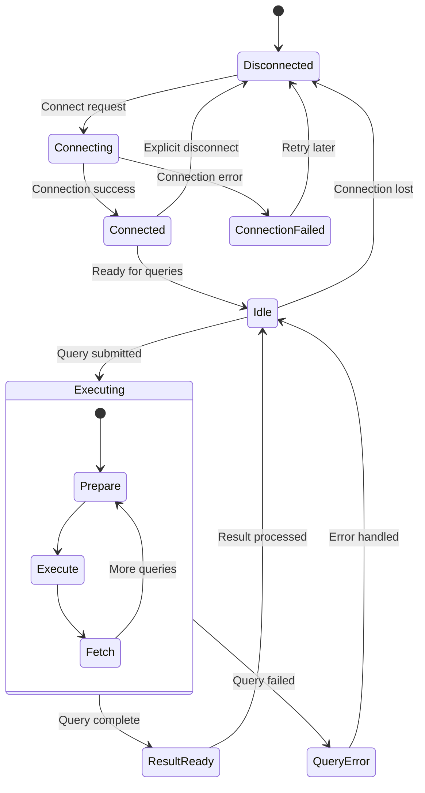

# Database Module State Diagram (sql_db.h/cpp)

## Overview
The Database Module manages all database operations for the VoipMonitor system, handling connections, query execution, data storage, and database maintenance tasks.

## State Diagram

## State Descriptions

### Disconnected
- **Purpose**: No database connection available
- **Activities**:
  - Monitor for connection requests
  - Clean up connection resources
  - Prepare for new connection attempts
- **Entry Conditions**: No active connection or connection lost
- **Exit Conditions**: Connection attempt initiated

### Connecting
- **Purpose**: Establishing database connection
- **Activities**:
  - Connect to MySQL/MariaDB server
  - Authenticate with database credentials
  - Set connection parameters
  - Verify database schema
- **Entry Conditions**: Connection request received
- **Exit Conditions**: Connection established or failed

### ConnectionFailed
- **Purpose**: Handle connection failure
- **Activities**:
  - Log connection error details
  - Determine retry strategy
  - Clean up partial connection state
  - Schedule reconnection attempt
- **Entry Conditions**: Database connection failed
- **Exit Conditions**: Ready for retry or giving up

### Connected
- **Purpose**: Database connection established
- **Activities**:
  - Verify connection health
  - Set session variables
  - Prepare for query execution
  - Initialize connection pools
- **Entry Conditions**: Successful database connection
- **Exit Conditions**: Ready for queries or disconnect

### Idle
- **Purpose**: Ready to process database queries
- **Activities**:
  - Wait for query requests
  - Monitor connection health
  - Handle connection keep-alive
  - Manage connection pooling
- **Entry Conditions**: Connection ready or query completed
- **Exit Conditions**: Query submitted or connection lost

### Executing
- **Purpose**: Processing database query
- **Activities**:
  - Prepare SQL statements
  - Execute queries
  - Fetch result sets
  - Handle query errors
- **Nested States**:
  - **Prepare**: Prepare SQL statement
  - **Execute**: Execute prepared statement
  - **Fetch**: Retrieve query results
- **Entry Conditions**: Query submitted for execution
- **Exit Conditions**: Query completed or error occurred

### ResultReady
- **Purpose**: Query results available
- **Activities**:
  - Process query results
  - Convert data types
  - Return results to caller
  - Clean up query resources
- **Entry Conditions**: Query executed successfully
- **Exit Conditions**: Results processed and returned

### QueryError
- **Purpose**: Handle query execution errors
- **Activities**:
  - Analyze error type and cause
  - Log error details
  - Determine retry strategy
  - Return error to caller
- **Entry Conditions**: Query execution failed
- **Exit Conditions**: Error handled and reported

## Database Operations

### Call Data Storage
- **CDR (Call Detail Records)**: Store call metadata
- **Audio Quality Metrics**: Store MOS, jitter, packet loss
- **SIP Messages**: Store SIP signaling data
- **RTP Statistics**: Store media stream statistics

### Registration Data
- **User Registrations**: Store SIP registration information
- **Authentication Data**: Store digest authentication details
- **Location Information**: Store contact and binding data
- **Registration Statistics**: Store registration metrics

### Configuration Data
- **System Configuration**: Store system parameters
- **User Preferences**: Store user-specific settings
- **Routing Rules**: Store call routing configuration
- **Billing Rules**: Store billing and rating information

### Statistics and Reporting
- **Performance Metrics**: Store system performance data
- **Quality Statistics**: Store call quality aggregates
- **Usage Reports**: Store usage and traffic data
- **Alert Information**: Store system alerts and events

## Connection Management

### Connection Pooling
- **Pool Size**: Maintain optimal number of connections
- **Connection Reuse**: Reuse existing connections
- **Load Balancing**: Distribute load across connections
- **Health Monitoring**: Monitor connection health

### Connection Recovery
- **Automatic Reconnection**: Reconnect on connection loss
- **Failover Support**: Switch to backup database servers
- **Transaction Recovery**: Handle interrupted transactions
- **Connection Validation**: Validate connections before use

### Performance Optimization
- **Prepared Statements**: Use prepared statements for efficiency
- **Batch Operations**: Group multiple operations together
- **Connection Caching**: Cache frequently used connections
- **Query Optimization**: Optimize SQL query performance

## Data Types and Schema

### Call Tables
- **cdr**: Main call detail record table
- **cdr_next**: Extended call information
- **cdr_rtp**: RTP stream statistics
- **cdr_dtmf**: DTMF event records

### Registration Tables
- **register_state**: Current registration states
- **register_failed**: Failed registration attempts
- **register**: Historical registration data

### Statistics Tables
- **cdr_stat**: Call statistics aggregates
- **rtp_stat**: RTP quality statistics
- **system_stat**: System performance metrics

### Configuration Tables
- **sensors**: Sensor configuration
- **filter_ip**: IP filtering rules
- **filter_telnum**: Phone number filters
- **billing**: Billing configuration

## Query Types and Patterns

### INSERT Operations
- **Call Data Insertion**: Insert new call records
- **Batch Inserts**: Insert multiple records efficiently
- **Prepared Inserts**: Use prepared statements for speed
- **Duplicate Handling**: Handle duplicate key conflicts

### SELECT Operations
- **Call Queries**: Retrieve call information
- **Statistics Queries**: Generate statistical reports
- **Configuration Queries**: Retrieve system settings
- **Complex Joins**: Multi-table relationship queries

### UPDATE Operations
- **Call Updates**: Update existing call records
- **Status Updates**: Update registration states
- **Configuration Updates**: Modify system settings
- **Bulk Updates**: Update multiple records

### DELETE Operations
- **Data Cleanup**: Remove old or expired data
- **Partition Maintenance**: Clean up table partitions
- **Archive Operations**: Move data to archive tables
- **Cascading Deletes**: Handle referential integrity

## Transaction Management

### ACID Properties
- **Atomicity**: Ensure all-or-nothing transactions
- **Consistency**: Maintain database consistency
- **Isolation**: Prevent transaction interference
- **Durability**: Ensure data persistence

### Transaction Handling
- **Begin Transaction**: Start transaction context
- **Commit Transaction**: Finalize successful transactions
- **Rollback Transaction**: Undo failed transactions
- **Savepoints**: Use savepoints for partial rollbacks

### Concurrency Control
- **Locking Strategies**: Use appropriate lock types
- **Deadlock Detection**: Handle deadlock situations
- **Lock Timeout**: Prevent indefinite waits
- **Read Consistency**: Ensure consistent read views

## Performance Monitoring

### Query Performance
- **Execution Time**: Monitor query execution times
- **Resource Usage**: Track CPU and memory usage
- **Index Usage**: Monitor index effectiveness
- **Slow Query Log**: Identify slow-running queries

### Connection Metrics
- **Active Connections**: Monitor connection usage
- **Connection Pool Status**: Track pool health
- **Connection Latency**: Measure connection response time
- **Error Rates**: Monitor connection error rates

### Database Health
- **Disk Usage**: Monitor database disk space
- **Table Sizes**: Track table growth
- **Index Statistics**: Monitor index usage
- **Replication Status**: Check replication health

## Error Handling and Recovery

### Connection Errors
- **Network Failures**: Handle network connectivity issues
- **Authentication Failures**: Handle login problems
- **Server Unavailable**: Handle server downtime
- **Timeout Errors**: Handle connection timeouts

### Query Errors
- **Syntax Errors**: Handle SQL syntax problems
- **Constraint Violations**: Handle integrity constraints
- **Resource Exhaustion**: Handle resource limits
- **Lock Timeouts**: Handle locking conflicts

### Recovery Strategies
- **Retry Logic**: Implement intelligent retry mechanisms
- **Circuit Breaker**: Prevent cascading failures
- **Graceful Degradation**: Continue operation with reduced functionality
- **Error Logging**: Log errors for analysis and debugging

## Configuration Parameters

### Connection Settings
- **Host and Port**: Database server connection details
- **Username/Password**: Authentication credentials
- **Database Name**: Target database name
- **Connection Timeout**: Connection establishment timeout

### Pool Settings
- **Min Pool Size**: Minimum number of connections
- **Max Pool Size**: Maximum number of connections
- **Pool Timeout**: Connection acquisition timeout
- **Idle Timeout**: Connection idle timeout

### Performance Settings
- **Query Timeout**: Maximum query execution time
- **Batch Size**: Number of records per batch operation
- **Cache Size**: Result set cache size
- **Buffer Size**: I/O buffer sizes

## Dependencies

- **MySQL/MariaDB Server**: Database server software
- **Connection Libraries**: MySQL client libraries
- **Configuration Module**: For database settings
- **Logging Module**: For error and performance logging
- **Statistics Module**: For performance metrics collection