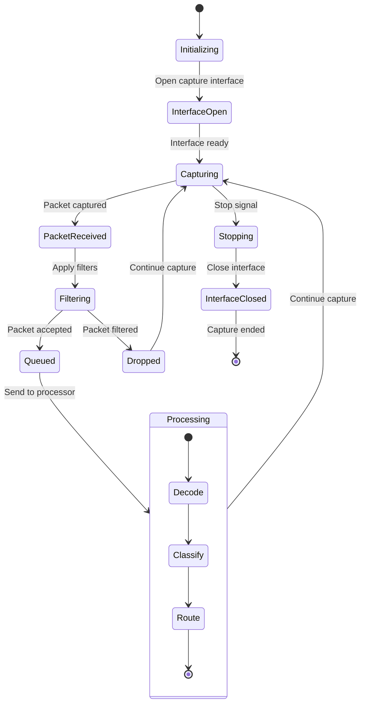

# Packet Capture Module State Diagram (pcap_queue.h/cpp)

## Overview
The Packet Capture Module handles network packet capture from various sources, manages packet queues, and provides filtered packet streams to processing modules.

## State Diagram

## State Descriptions

### Initializing
- **Purpose**: Initialize packet capture system
- **Activities**:
  - Load capture configuration
  - Initialize packet buffers
  - Set up capture interfaces
  - Prepare filtering rules
- **Entry Conditions**: System startup or capture restart
- **Exit Conditions**: Initialization complete

### InterfaceOpen
- **Purpose**: Open network capture interface
- **Activities**:
  - Open pcap handle or interface
  - Set capture parameters
  - Apply BPF filters
  - Start capture threads
- **Entry Conditions**: Interface selection complete
- **Exit Conditions**: Interface ready for capture

### Capturing
- **Purpose**: Active packet capture state
- **Activities**:
  - Capture packets from interface
  - Monitor capture statistics
  - Handle interface errors
  - Manage capture buffers
- **Entry Conditions**: Interface opened successfully
- **Exit Conditions**: Packet received or stop signal

### PacketReceived
- **Purpose**: Process newly captured packet
- **Activities**:
  - Extract packet headers
  - Timestamp packet
  - Validate packet structure
  - Prepare for filtering
- **Entry Conditions**: Packet captured from interface
- **Exit Conditions**: Packet ready for filtering

### Filtering
- **Purpose**: Apply packet filtering rules
- **Activities**:
  - Check IP addresses
  - Validate protocol types
  - Apply port filters
  - Check packet size limits
- **Entry Conditions**: Packet received and validated
- **Exit Conditions**: Filter decision made

### Queued
- **Purpose**: Packet accepted and queued
- **Activities**:
  - Add packet to processing queue
  - Update queue statistics
  - Check queue capacity
  - Signal processing threads
- **Entry Conditions**: Packet passed filters
- **Exit Conditions**: Packet queued for processing

### Dropped
- **Purpose**: Packet rejected by filters
- **Activities**:
  - Update drop statistics
  - Log dropped packet info
  - Free packet memory
  - Continue capture
- **Entry Conditions**: Packet failed filters
- **Exit Conditions**: Packet discarded

### Processing
- **Purpose**: Route packet to appropriate processor
- **Activities**:
  - Decode packet headers
  - Classify packet type
  - Route to protocol handler
  - Update processing statistics
- **Nested States**:
  - **Decode**: Parse packet headers
  - **Classify**: Determine packet type
  - **Route**: Send to appropriate handler
- **Entry Conditions**: Packet dequeued for processing
- **Exit Conditions**: Packet routed to handler

### Stopping
- **Purpose**: Graceful capture shutdown
- **Activities**:
  - Stop capture threads
  - Process remaining packets
  - Flush packet queues
  - Prepare for interface close
- **Entry Conditions**: Stop signal received
- **Exit Conditions**: Capture threads stopped

### InterfaceClosed
- **Purpose**: Close capture interface
- **Activities**:
  - Close pcap handle
  - Free interface resources
  - Generate capture statistics
  - Clean up buffers
- **Entry Conditions**: Capture stopped
- **Exit Conditions**: Interface closed and cleaned up

## Capture Sources

### Network Interfaces
- **Ethernet Interfaces**: Standard network adapters
- **Wireless Interfaces**: WiFi adapters
- **Virtual Interfaces**: VM and container interfaces
- **SPAN Ports**: Switch port mirroring
- **TAP Devices**: Network tap appliances

### File Sources
- **PCAP Files**: Standard packet capture files
- **PCAPNG Files**: Next generation capture format
- **Compressed Files**: Gzip compressed captures
- **Remote Files**: Network-accessible capture files

### Specialized Sources
- **DPDK**: Data Plane Development Kit
- **PF_RING**: High-speed packet capture
- **Netmap**: Fast packet I/O framework
- **AF_PACKET**: Linux packet socket

## Packet Processing Pipeline

### Layer 2 Processing
- **Ethernet Header**: Extract MAC addresses
- **VLAN Tags**: Process 802.1Q tags
- **MPLS Labels**: Handle MPLS encapsulation
- **Frame Check**: Validate frame integrity

### Layer 3 Processing
- **IP Header**: Extract IP addresses and protocol
- **IPv6 Support**: Handle IPv6 packets
- **Fragmentation**: Handle IP fragmentation
- **Tunneling**: Process tunneled packets (GRE, IPIP)

### Layer 4 Processing
- **TCP Processing**: Extract TCP ports and flags
- **UDP Processing**: Extract UDP ports
- **SCTP Support**: Handle SCTP packets
- **Protocol Detection**: Identify application protocols

### Application Layer
- **SIP Detection**: Identify SIP packets
- **RTP Detection**: Identify RTP streams
- **HTTP Detection**: Identify web traffic
- **SSL/TLS Detection**: Identify encrypted traffic

## Filtering and Classification

### BPF Filters
- **Berkeley Packet Filter**: Low-level packet filtering
- **Kernel Filtering**: Filter at kernel level
- **Hardware Filtering**: Use NIC filtering capabilities
- **Custom Filters**: Application-specific filters

### IP Address Filtering
- **Source IP**: Filter by source address
- **Destination IP**: Filter by destination address
- **Subnet Filtering**: Filter by network ranges
- **Blacklist/Whitelist**: Include/exclude specific IPs

### Port Filtering
- **SIP Ports**: Standard SIP ports (5060, 5061)
- **RTP Port Ranges**: Dynamic RTP port ranges
- **Custom Ports**: User-defined port filters
- **Protocol-based**: Filter by protocol type

### Advanced Filtering
- **VLAN Filtering**: Filter by VLAN ID
- **Quality of Service**: Filter by DSCP/ToS
- **Packet Size**: Filter by packet length
- **Time-based**: Filter by time ranges

## Queue Management

### Queue Types
- **FIFO Queues**: First-in-first-out processing
- **Priority Queues**: Priority-based processing
- **Ring Buffers**: Circular buffer implementation
- **Lock-free Queues**: High-performance queues

### Queue Monitoring
- **Queue Depth**: Monitor queue fill levels
- **Drop Statistics**: Track dropped packets
- **Processing Rate**: Monitor packet processing speed
- **Memory Usage**: Track queue memory consumption

### Flow Control
- **Back Pressure**: Handle queue overflow
- **Rate Limiting**: Limit packet processing rate
- **Load Balancing**: Distribute across queues
- **Adaptive Sizing**: Adjust queue sizes dynamically

## Performance Optimization

### High-Speed Capture
- **Zero-Copy**: Minimize packet copying
- **Memory Mapping**: Use memory-mapped I/O
- **Batch Processing**: Process packets in batches
- **CPU Affinity**: Bind threads to specific CPUs

### Memory Management
- **Buffer Pools**: Pre-allocated packet buffers
- **Memory Alignment**: Optimize memory access
- **Huge Pages**: Use large memory pages
- **NUMA Awareness**: Consider NUMA topology

### Threading Model
- **Capture Threads**: Dedicated capture threads
- **Worker Threads**: Packet processing threads
- **Thread Pools**: Managed thread pools
- **Lock-free Design**: Minimize synchronization

## Statistics and Monitoring

### Capture Statistics
- **Packets Captured**: Total packets received
- **Packets Dropped**: Packets lost due to overload
- **Bytes Captured**: Total data volume
- **Capture Rate**: Packets per second

### Interface Statistics
- **Interface Utilization**: Network utilization
- **Error Rates**: Interface error counters
- **Duplex/Speed**: Interface characteristics
- **Link Status**: Interface up/down status

### Performance Metrics
- **CPU Usage**: Capture thread CPU usage
- **Memory Usage**: Buffer memory consumption
- **Queue Depths**: Processing queue levels
- **Latency**: Packet processing latency

## Error Handling

### Interface Errors
- **Interface Down**: Handle interface failures
- **Permission Errors**: Handle access denied
- **Driver Issues**: Handle driver problems
- **Hardware Failures**: Handle NIC failures

### Capture Errors
- **Buffer Overruns**: Handle capture buffer overflow
- **Packet Corruption**: Handle corrupted packets
- **Timestamp Issues**: Handle timing problems
- **Resource Exhaustion**: Handle memory/CPU limits

### Recovery Mechanisms
- **Automatic Restart**: Restart failed captures
- **Interface Failover**: Switch to backup interfaces
- **Graceful Degradation**: Reduce capture rate
- **Error Reporting**: Report errors to management

## Configuration Parameters

### Capture Settings
- **Interface Selection**: Choose capture interfaces
- **Capture Filter**: Set BPF filter expression
- **Buffer Size**: Set capture buffer sizes
- **Timeout Values**: Set capture timeouts

### Performance Settings
- **Thread Count**: Number of processing threads
- **Queue Sizes**: Packet queue sizes
- **Memory Limits**: Maximum memory usage
- **CPU Affinity**: Thread CPU binding

### Filtering Settings
- **IP Ranges**: Allowed/blocked IP ranges
- **Port Lists**: Monitored port ranges
- **Protocol Selection**: Enabled protocols
- **VLAN Configuration**: VLAN filtering rules

## Dependencies

- **libpcap**: Packet capture library
- **Network Drivers**: Interface drivers
- **Filtering Engine**: Packet filtering system
- **Queue Management**: Packet queue system
- **Statistics Module**: Performance monitoring