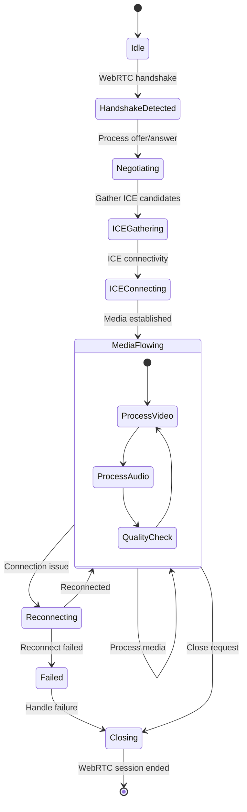

# WebRTC Processing Module State Diagram (webrtc.h/cpp)

## Overview
The WebRTC Processing Module handles WebRTC session analysis, including signaling, media negotiation, and real-time communication data processing for web-based voice and video calls.

## State Diagram

## State Descriptions

### Idle
- **Purpose**: No active WebRTC session
- **Activities**:
  - Monitor for WebRTC signaling
  - Clean up expired session data
  - Prepare for new sessions
- **Entry Conditions**: No WebRTC session active
- **Exit Conditions**: WebRTC handshake detected

### HandshakeDetected
- **Purpose**: Initial WebRTC session detection
- **Activities**:
  - Detect WebSocket upgrade requests
  - Identify WebRTC signaling protocols
  - Parse initial handshake messages
  - Prepare for session negotiation
- **Entry Conditions**: WebRTC signaling detected
- **Exit Conditions**: Handshake validated

### Negotiating
- **Purpose**: Session parameter negotiation
- **Activities**:
  - Process SDP offer/answer
  - Parse media capabilities
  - Handle codec negotiation
  - Process session descriptions
- **Entry Conditions**: Handshake complete
- **Exit Conditions**: Session parameters agreed

### ICEGathering
- **Purpose**: ICE candidate collection
- **Activities**:
  - Gather STUN/TURN candidates
  - Collect host candidates
  - Process reflexive candidates
  - Handle peer-reflexive candidates
- **Entry Conditions**: Session negotiation complete
- **Exit Conditions**: ICE candidates gathered

### ICEConnecting
- **Purpose**: ICE connectivity establishment
- **Activities**:
  - Perform ICE connectivity checks
  - Establish media paths
  - Handle DTLS handshake
  - Set up SRTP encryption
- **Entry Conditions**: ICE gathering complete
- **Exit Conditions**: Media connectivity established

### MediaFlowing
- **Purpose**: Active media session
- **Activities**:
  - Process RTP/RTCP streams
  - Handle video frames
  - Process audio samples
  - Monitor media quality
- **Nested States**:
  - **ProcessVideo**: Handle video streams
  - **ProcessAudio**: Handle audio streams
  - **QualityCheck**: Monitor media quality
- **Entry Conditions**: Media connectivity established
- **Exit Conditions**: Connection issue or close request

### Reconnecting
- **Purpose**: Handle connection recovery
- **Activities**:
  - Attempt ICE restart
  - Re-establish media paths
  - Handle network changes
  - Restore media streams
- **Entry Conditions**: Connection failure detected
- **Exit Conditions**: Connection restored or failed

### Failed
- **Purpose**: Session failure handling
- **Activities**:
  - Analyze failure reasons
  - Generate failure reports
  - Clean up partial session data
  - Log error information
- **Entry Conditions**: Unrecoverable failure
- **Exit Conditions**: Failure processed

### Closing
- **Purpose**: Session termination
- **Activities**:
  - Process close messages
  - Stop media streams
  - Clean up session resources
  - Generate session statistics
- **Entry Conditions**: Close request or failure
- **Exit Conditions**: Session cleanup complete

## WebRTC Protocol Stack

### Signaling Layer
- **WebSocket**: WebSocket-based signaling
- **SIP over WebSocket**: SIP signaling transport
- **XMPP**: Extensible messaging protocol
- **Custom Protocols**: Application-specific signaling

### Session Description
- **SDP (Session Description Protocol)**: Media negotiation
- **Offer/Answer Model**: Session parameter exchange
- **Media Lines**: Audio/video stream descriptions
- **Codec Negotiation**: Supported codec selection

### ICE (Interactive Connectivity Establishment)
- **STUN (Session Traversal Utilities for NAT)**: NAT traversal
- **TURN (Traversal Using Relays around NAT)**: Relay servers
- **Host Candidates**: Local network addresses
- **Reflexive Candidates**: Public IP addresses

### Security Layer
- **DTLS (Datagram Transport Layer Security)**: Key exchange
- **SRTP (Secure Real-time Transport Protocol)**: Media encryption
- **SRTCP**: Control protocol encryption
- **Certificate Validation**: Identity verification

## Media Processing

### Audio Processing
- **Codec Support**: Opus, G.711, G.722, iLBC
- **Audio Quality**: Analyze audio metrics
- **Echo Cancellation**: Detect echo issues
- **Noise Suppression**: Identify noise problems

### Video Processing
- **Codec Support**: VP8, VP9, H.264, AV1
- **Frame Analysis**: Process video frames
- **Resolution Changes**: Handle dynamic resolution
- **Bitrate Adaptation**: Monitor bitrate changes

### Real-time Transport
- **RTP Processing**: Handle RTP streams
- **RTCP Feedback**: Process control messages
- **Jitter Buffer**: Manage packet timing
- **Packet Loss**: Handle missing packets

## Quality Metrics

### Audio Quality
- **MOS Scores**: Mean Opinion Score calculation
- **Packet Loss**: Audio packet loss rates
- **Jitter**: Audio timing variation
- **Round-trip Time**: Audio latency measurement

### Video Quality
- **Frame Rate**: Video frame rate analysis
- **Resolution**: Video resolution tracking
- **Bitrate**: Video bitrate monitoring
- **Frame Loss**: Video frame loss detection

### Network Quality
- **Bandwidth Usage**: Network utilization
- **Connection Type**: ICE candidate types
- **Network Changes**: Connectivity transitions
- **TURN Usage**: Relay server utilization

## WebSocket Processing

### WebSocket Handshake
- **HTTP Upgrade**: Process upgrade requests
- **Protocol Negotiation**: Select WebSocket protocols
- **Extension Negotiation**: Handle WebSocket extensions
- **Security Validation**: Validate security headers

### Message Processing
- **Frame Parsing**: Parse WebSocket frames
- **Message Types**: Handle text/binary messages
- **Fragmentation**: Handle fragmented messages
- **Control Frames**: Process ping/pong/close frames

### Data Extraction
- **Signaling Messages**: Extract WebRTC signaling
- **Media Metadata**: Extract media information
- **Statistics Data**: Extract performance metrics
- **Error Information**: Extract error details

## Session Management

### Session Tracking
- **Session Identification**: Track unique sessions
- **Participant Management**: Handle multiple participants
- **Media Stream Tracking**: Track individual streams
- **State Synchronization**: Maintain session state

### Resource Management
- **Memory Allocation**: Manage session memory
- **Connection Pooling**: Reuse connection resources
- **Buffer Management**: Handle media buffers
- **Cleanup Procedures**: Clean up expired sessions

### Statistics Collection
- **Call Duration**: Track session length
- **Media Statistics**: Collect media metrics
- **Quality Reports**: Generate quality summaries
- **Performance Data**: Collect performance metrics

## Error Handling

### Connection Errors
- **Network Failures**: Handle connectivity issues
- **ICE Failures**: Handle ICE establishment failures
- **DTLS Errors**: Handle security handshake failures
- **Media Errors**: Handle media stream failures

### Protocol Errors
- **SDP Parsing**: Handle malformed SDP
- **WebSocket Errors**: Handle WebSocket failures
- **Signaling Errors**: Handle signaling protocol errors
- **Codec Errors**: Handle unsupported codecs

### Recovery Mechanisms
- **ICE Restart**: Restart ICE connectivity
- **Media Recovery**: Recover media streams
- **Session Recovery**: Attempt session recovery
- **Graceful Degradation**: Reduce quality if needed

## Performance Optimization

### Processing Efficiency
- **Parallel Processing**: Process multiple sessions
- **Memory Optimization**: Efficient memory usage
- **CPU Optimization**: Optimize CPU usage
- **Network Optimization**: Minimize network overhead

### Scalability
- **Session Limits**: Handle session capacity
- **Resource Scaling**: Scale resources dynamically
- **Load Distribution**: Distribute processing load
- **Cluster Support**: Support clustered deployments

## Configuration Parameters

### Protocol Settings
- **Supported Codecs**: Configure supported codecs
- **ICE Configuration**: Configure STUN/TURN servers 
- **Security Settings**: Configure DTLS/SRTP options
- **Quality Thresholds**: Set quality monitoring limits

### Performance Settings
- **Session Limits**: Maximum concurrent sessions
- **Buffer Sizes**: Media buffer configurations
- **Timeout Values**: Various timeout settings
- **Thread Pool Size**: Processing thread configuration

### Monitoring Settings
- **Statistics Interval**: Metrics collection frequency
- **Quality Reporting**: Quality report generation
- **Logging Level**: Diagnostic logging level
- **Alert Thresholds**: Performance alert limits

## Dependencies

- **WebSocket Library**: WebSocket protocol implementation
- **SDP Parser**: Session Description Protocol parser
- **ICE Library**: ICE connectivity establishment
- **DTLS/SRTP**: Security protocol implementations
- **Media Codecs**: Audio/video codec libraries
- **RTP Processing**: Real-time transport processing