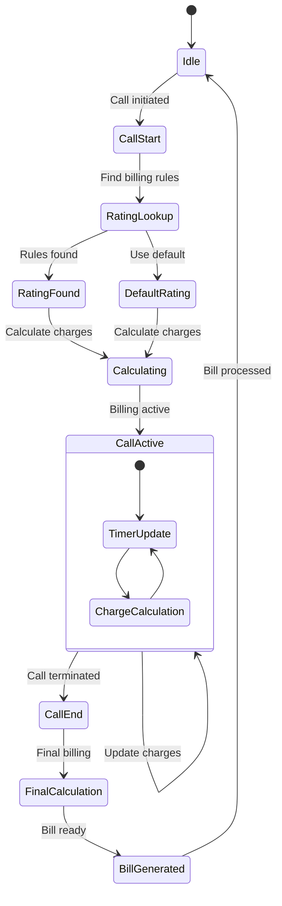
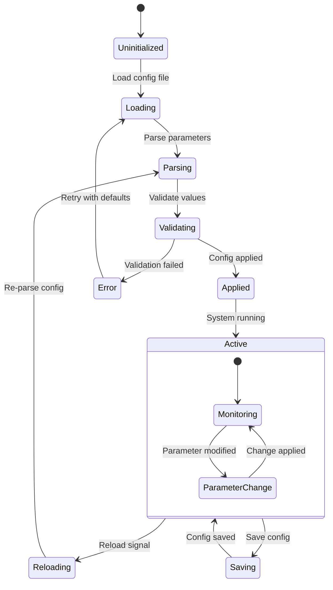
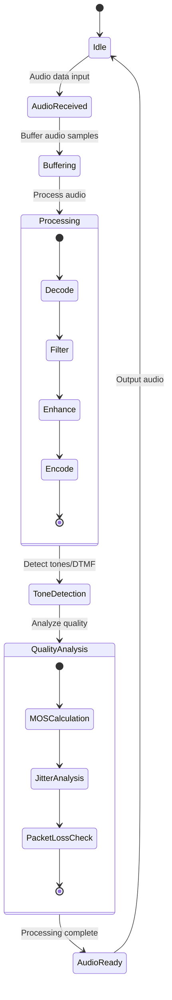
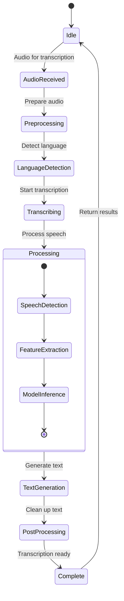
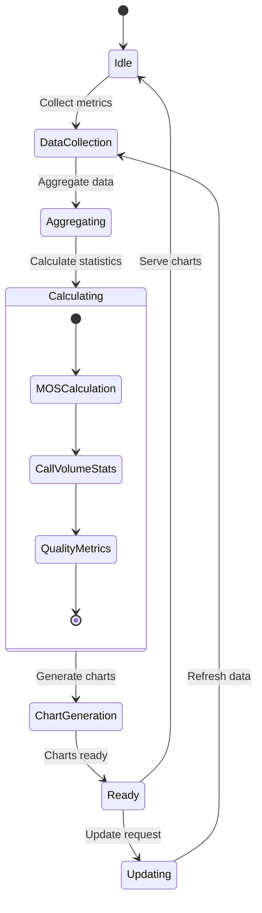
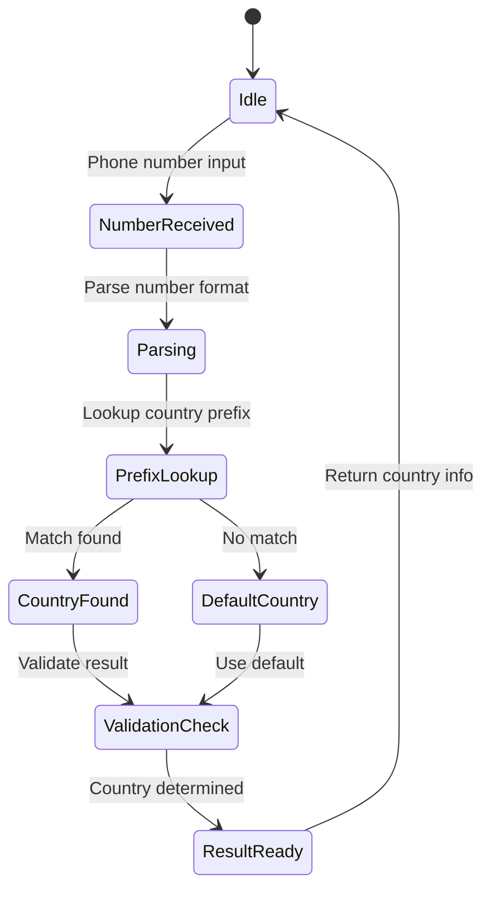
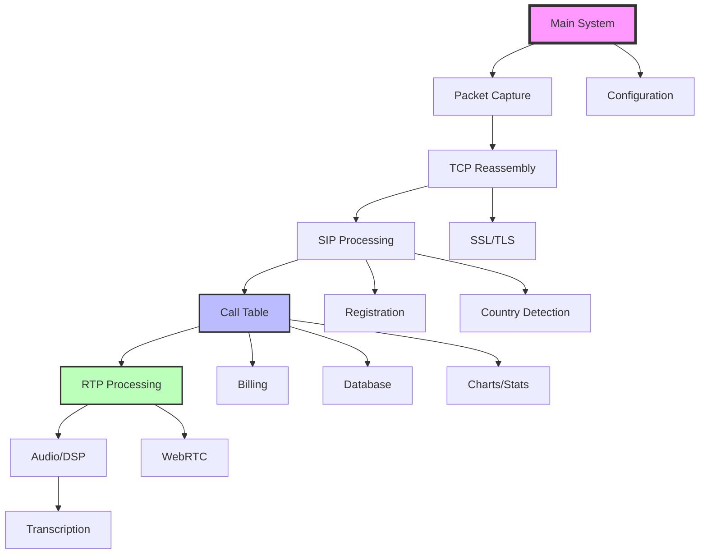

# Remaining Modules State Diagrams

## 10. Billing Module State Diagram (billing.h/cpp)

### Overview
The Billing Module handles call billing and charging calculations, managing billing rules, rate tables, and generating billing records for VoIP calls.

### State Diagram

---

## 11. Configuration Module State Diagram (config_param.h/cpp)

### Overview
The Configuration Module manages system configuration parameters, handles configuration file parsing, and provides dynamic configuration updates.

### State Diagram

---

## 12. Audio Processing/DSP Module State Diagram (dsp.h/cpp)

### Overview
The Audio Processing/DSP Module handles digital signal processing for audio streams, including tone detection, quality analysis, and audio enhancement.

### State Diagram

---

## 13. Transcription Module State Diagram (transcribe.h/cpp)

### Overview
The Transcription Module handles speech-to-text conversion for recorded calls, using machine learning models to generate text transcripts from audio.

### State Diagram

---

## 14. Charts/Statistics Module State Diagram (charts.h/cpp)

### Overview
The Charts/Statistics Module generates performance reports, call quality statistics, and visual charts for system monitoring and analysis.

### State Diagram

---

## 15. Country Detection Module State Diagram (country_detect.h/cpp)

### Overview
The Country Detection Module analyzes phone numbers to determine geographic origins, supporting international call analysis and routing decisions.

### State Diagram

---

## Module Integration Overview

### Data Flow Between Modules

### State Synchronization

All modules maintain their states independently but coordinate through:

1. **Event-driven Communication**: Modules communicate through events and callbacks
2. **Shared Data Structures**: Common data structures for call and session information
3. **Configuration Synchronization**: Centralized configuration management
4. **Database Coordination**: Shared database for persistent state
5. **Error Propagation**: Error conditions propagated across related modules

### Common State Patterns

Each module follows similar state transition patterns:

1. **Initialization Phase**: Setup and resource allocation
2. **Active Processing**: Main operational states with data processing
3. **Error Handling**: Recovery mechanisms and error states
4. **Cleanup Phase**: Resource deallocation and state cleanup

### Performance Considerations

- **Concurrent Processing**: Multiple instances of each module can run concurrently
- **State Isolation**: Each instance maintains independent state
- **Resource Management**: Careful resource allocation and cleanup
- **Scalability**: Modules designed to scale with system load