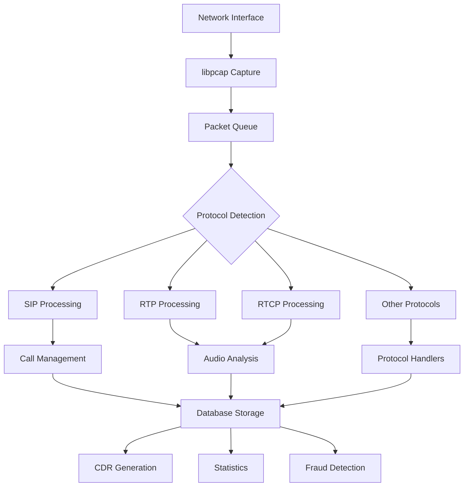
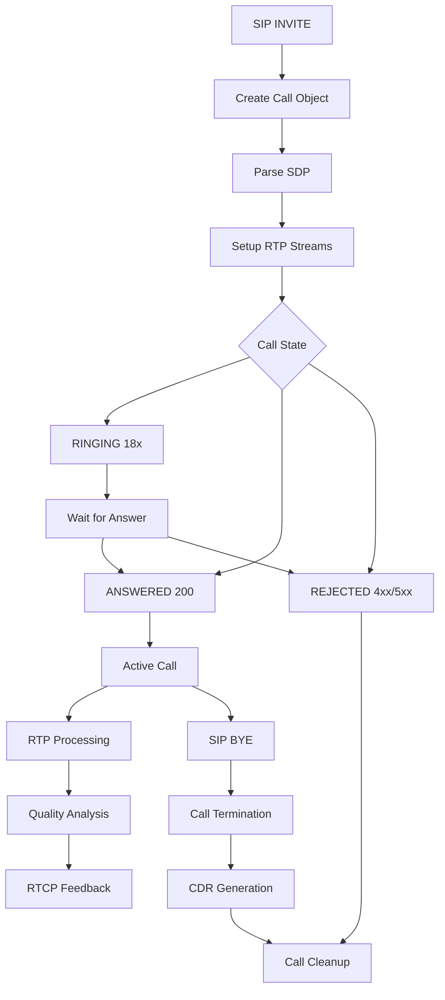
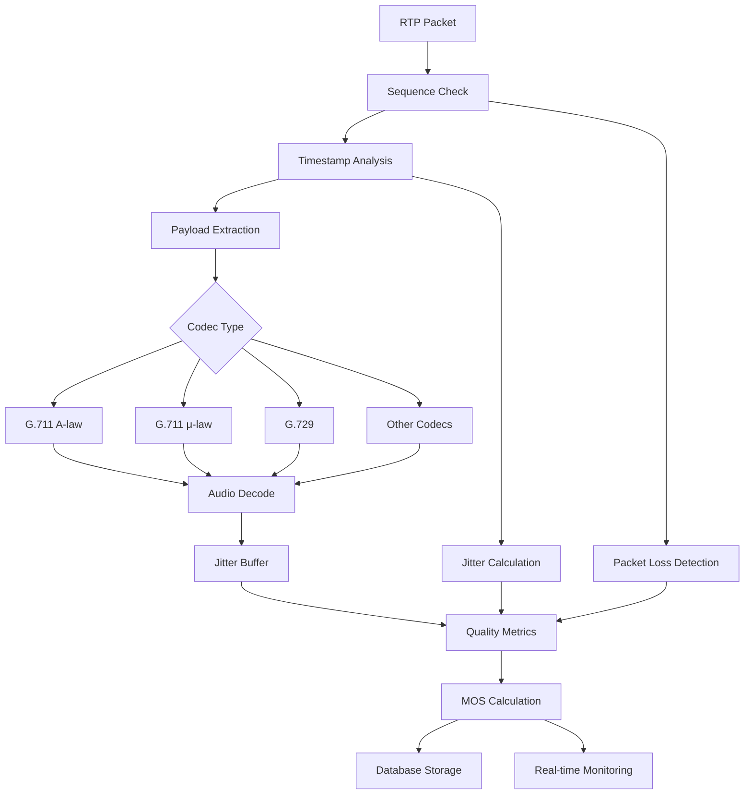
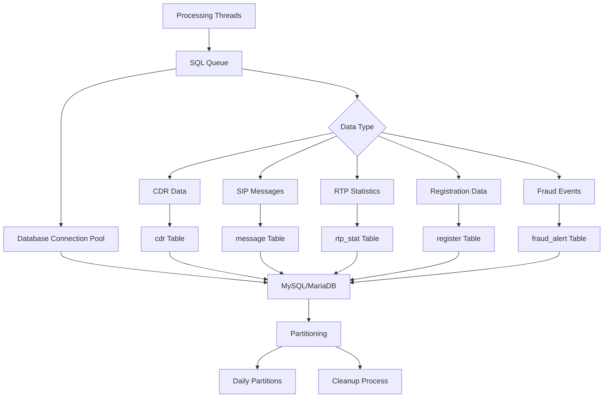
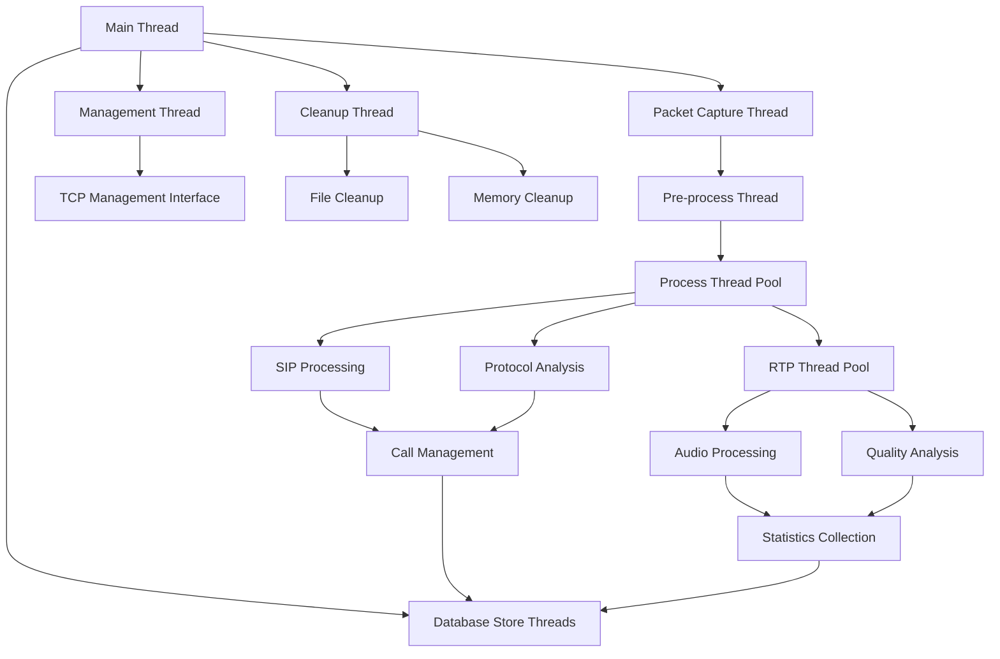

# VoIPmonitor Codebase Analysis

## Project Overview

VoIPmonitor is a high-performance, multi-threaded C++ network packet sniffer designed for real-time monitoring and analysis of VoIP protocols including SIP, RTP, RTCP, SKINNY/SCCP, MGCP, and SS7. The system is built for telecommunications operators and service providers requiring detailed call quality analysis, fraud detection, and network troubleshooting capabilities.

**Version**: 2025.07.1  
**License**: GNU GPL v2  
**Language**: C++ with some C components  
**Build System**: GNU Autotools (autoconf/automake)

## Core Architecture Components

### 1. Main Application Framework (`voipmonitor.cpp/h`)
- **Entry Point**: `main()` function handles initialization, configuration, and daemon setup
- **Global State Management**: Manages system-wide variables, configuration, and runtime state
- **Signal Handling**: Graceful shutdown, configuration reload, hot restart capabilities
- **Memory Management**: Heap safety, memory statistics, and allocation tracking

### 2. Packet Capture & Processing Pipeline

#### Packet Queue System (`pcap_queue.cpp/h`, `pcap_queue_block.h`)
```
Network Interface → libpcap → Packet Queue → Processing Threads → Analysis
```

**Key Components**:
- `pcap_block_store`: Memory-efficient packet storage blocks
- `pcap_block_store_queue`: Thread-safe packet queuing
- `pcap_file_store`: Disk-based packet buffering for high-volume scenarios
- `pcap_store_queue`: Manages disk storage queues

**Processing Flow**:
1. **Capture Thread**: Reads packets from network interface via libpcap
2. **Pre-processing**: Packet deduplication, fragmentation handling, VLAN processing
3. **Classification**: Protocol detection (SIP, RTP, RTCP, etc.)
4. **Queuing**: Distributes packets to appropriate processing threads

#### Packet Structures (`sniff.h`)
- `packet_s`: Base packet structure with metadata
- `packet_s_process`: Extended structure for processing pipeline
- `packet_s_stack`: Stack-based packet processing
- `sHeaderPacket`: Packet header information

### 3. Protocol Processing Modules

#### SIP Processing (`sniff.cpp/h`)
- **SIP Message Parsing**: Complete SIP protocol implementation
- **Call State Management**: INVITE, ACK, BYE, CANCEL handling
- **Session Description Protocol (SDP)**: Media session negotiation
- **Authentication**: Digest authentication support
- **NAT Traversal**: Handle NAT scenarios and IP translation

#### RTP/RTCP Processing (`rtp.cpp/h`, `rtcp.cpp/h`)
- **RTP Stream Analysis**: Sequence numbers, timestamps, payload analysis
- **Jitter Buffer**: Audio quality analysis using Asterisk jitterbuffer
- **RTCP Statistics**: Sender/receiver reports, quality metrics
- **Codec Support**: G.711 (A-law/μ-law), G.729, G.722, and others
- **SRTP Decryption**: Secure RTP processing

#### Additional Protocols
- **MGCP** (`mgcp.cpp/h`): Media Gateway Control Protocol
- **SKINNY/SCCP** (`skinny.cpp/h`): Cisco proprietary protocol
- **SS7** (`ss7.cpp/h`): Signaling System 7 for telecom networks
- **WebRTC** (`webrtc.cpp/h`): Web Real-Time Communication
- **Diameter** (`diameter.cpp/h`): Authentication, Authorization, Accounting

### 4. Call Management System

#### Call Table (`calltable.cpp/h`)
- **Call**: Main call object managing entire call lifecycle
- **CallBranch**: Handles call legs and transfers
- **CallStructs**: Common call data structures
- **Calltable**: Global call registry and management

**Call States**:
```
INVITE → RINGING (18x) → ANSWERED (200) → ACTIVE → BYE → TERMINATED
```

**Key Features**:
- Multi-party call support
- Call transfer and redirect handling
- Call quality metrics (MOS, jitter, packet loss)
- CDR (Call Detail Records) generation

### 5. Database Layer (`sql_db.cpp/h`)

#### Database Support
- **MySQL/MariaDB**: Primary database backend
- **ODBC**: Alternative database connectivity
- **Connection Pooling**: Efficient database connection management
- **Prepared Statements**: SQL injection prevention and performance

#### Data Storage
- **CDR Tables**: Call detail records with quality metrics
- **SIP Message Tables**: Complete SIP message logging
- **RTP Statistics**: Detailed stream quality data
- **Registration Tables**: SIP registration tracking
- **Fraud Detection Tables**: Security event logging

### 6. Audio Processing (`dsp.cpp/h`, `jitterbuffer/`)

#### Digital Signal Processing
- **Audio Mixing**: Multi-channel audio combination
- **Format Conversion**: WAV, OGG, MP3 support
- **Quality Analysis**: MOS calculation, noise detection
- **DTMF Detection**: Dual-tone multi-frequency analysis

#### Jitter Buffer (Asterisk-based)
- **Adaptive Buffering**: Dynamic jitter compensation
- **Packet Loss Concealment**: Audio quality improvement
- **Timing Recovery**: Clock synchronization

### 7. Security & Encryption

#### SSL/TLS Processing (`ssl.cpp/h`, `dssl/`)
- **TLS Decryption**: Real-time SSL/TLS traffic analysis
- **Certificate Management**: X.509 certificate handling
- **Session Key Extraction**: For encrypted traffic analysis
- **SRTP Key Derivation**: Secure RTP decryption

#### Fraud Detection (`fraud.cpp/h`)
- **Call Pattern Analysis**: Unusual calling patterns
- **Geographic Anomalies**: International fraud detection
- **Rate Limiting**: Call frequency monitoring
- **Registration Abuse**: SIP registration attacks
- **Concurrent Call Detection**: Multiple simultaneous calls

### 8. Configuration Management (`config_param.cpp/h`)
- **Dynamic Configuration**: Runtime parameter changes
- **Configuration Validation**: Parameter checking and defaults
- **Hot Reload**: Configuration updates without restart
- **Multiple Sources**: Config files, database, command line

### 9. Network Utilities

#### TCP Reassembly (`tcpreassembly.cpp/h`)
- **Stream Reconstruction**: TCP segment reassembly
- **HTTP Processing**: Web traffic analysis
- **SIP over TCP**: Reliable SIP transport
- **WebRTC Signaling**: WebSocket and HTTP/2 support

#### IP Fragmentation (`ip_frag.cpp/h`)
- **Fragment Reassembly**: IPv4/IPv6 fragmentation handling
- **Timeout Management**: Fragment cleanup
- **Memory Optimization**: Efficient fragment storage

### 10. Monitoring & Management

#### Management Interface (`manager.cpp/h`)
- **TCP Control Interface**: Remote management and monitoring
- **Statistics Reporting**: Real-time system metrics
- **Call Monitoring**: Live call observation
- **Configuration Interface**: Remote configuration changes

#### Performance Monitoring (`pstat.cpp/h`)
- **CPU Usage Tracking**: Per-thread performance metrics
- **Memory Statistics**: Heap usage and allocation tracking
- **Network Statistics**: Packet processing rates
- **Queue Monitoring**: Buffer utilization tracking

## Data Flow Diagrams

### 1. Main Packet Processing Flow



### 2. Call Lifecycle Management



### 3. RTP Stream Processing



### 4. Database Storage Architecture



### 5. Multi-threading Architecture



## Key Algorithms and Techniques

### 1. Packet Processing Optimization
- **Zero-copy Techniques**: Minimize memory allocations in hot paths
- **Lock-free Queues**: High-performance inter-thread communication
- **Memory Pools**: Pre-allocated memory for frequent operations
- **SIMD Instructions**: Vectorized operations for bulk processing

### 2. Call Quality Analysis
- **E-model Implementation**: ITU-T G.107 quality prediction
- **Adaptive Jitter Buffer**: Dynamic buffer size adjustment
- **Packet Loss Concealment**: Audio quality improvement algorithms
- **Echo Detection**: Acoustic echo identification

### 3. Fraud Detection Algorithms
- **Pattern Recognition**: Statistical analysis of call patterns
- **Geographical Analysis**: Location-based anomaly detection
- **Time-series Analysis**: Temporal pattern recognition
- **Machine Learning**: Adaptive fraud detection models

### 4. Performance Optimizations
- **CPU Affinity**: Thread-to-core binding for performance
- **NUMA Awareness**: Memory locality optimization
- **Prefetching**: Cache optimization techniques
- **Branch Prediction**: Hot path optimization

## File Organization Summary

### Core System Files
- `voipmonitor.cpp/h` - Main application and initialization
- `sniff.cpp/h` - Core packet processing and protocol detection
- `calltable.cpp/h` - Call management and lifecycle
- `tools.cpp/h` - Utility functions and data structures

### Protocol Handlers
- `rtp.cpp/h` - RTP stream processing
- `rtcp.cpp/h` - RTCP statistics and feedback
- `mgcp.cpp/h` - MGCP protocol support
- `skinny.cpp/h` - SKINNY/SCCP protocol
- `webrtc.cpp/h` - WebRTC support

### Infrastructure
- `pcap_queue.cpp/h` - Packet queuing system
- `sql_db.cpp/h` - Database abstraction layer
- `tcpreassembly.cpp/h` - TCP stream reconstruction
- `ssl.cpp/h` - SSL/TLS processing

### Audio & Quality
- `dsp.cpp/h` - Digital signal processing
- `jitterbuffer/` - Asterisk jitter buffer implementation
- `codec_*.cpp/h` - Audio codec support

### Security & Monitoring
- `fraud.cpp/h` - Fraud detection system
- `manager.cpp/h` - Management interface
- `register.cpp/h` - SIP registration tracking

This analysis provides a comprehensive overview of the VoIPmonitor architecture, showing how each component contributes to the overall system functionality for high-performance VoIP monitoring and analysis.