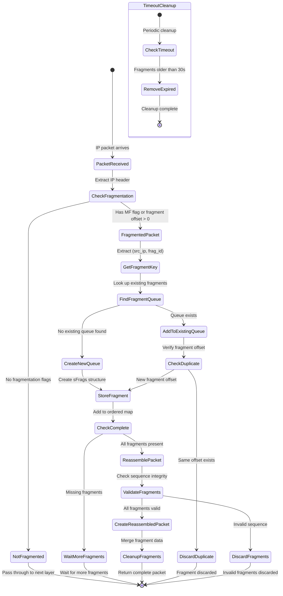
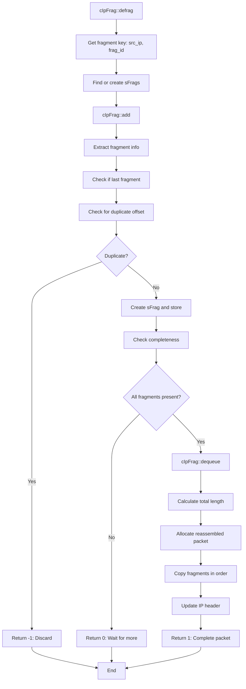
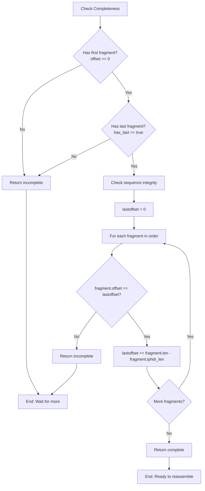
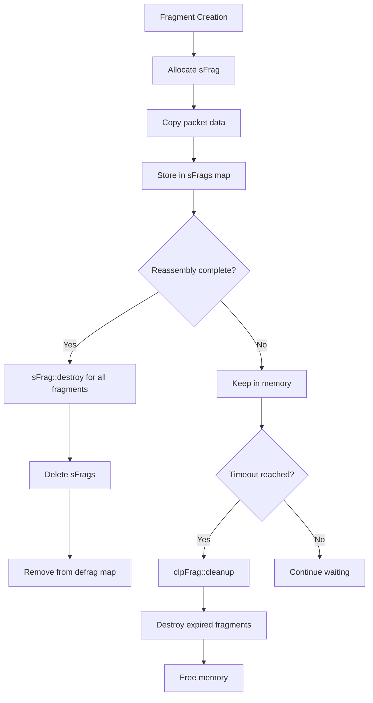

# IP Fragmentation and Reassembly - State and Function Diagram

## Overview
This diagram shows the IP fragmentation handling and reassembly process in the VoIP monitoring system, primarily implemented in `ip_frag.h` and `ip_frag.cpp`.

## IP Reassembly State Machine



## Key Data Structures

### 1. Fragment Structure (`sFrag`)
```cpp
struct sFrag {
    sHeaderPacket *header_packet;        // Original packet header
    void *header_packet_pqout;           // Packet queue output
    unsigned int header_ip_offset;       // IP header offset in packet
    time_t ts;                          // Timestamp for timeout
    u_int32_t offset;                   // Fragment offset
    u_int32_t len;                      // Fragment length
    u_int16_t iphdr_len;               // IP header length
};
```

### 2. Fragment Collection (`sFrags`)
```cpp
struct sFrags : map<u_int16_t, sFrag*> {
    bool has_last;  // Indicates if last fragment received
};
```

### 3. Defragmentation Map (`sDefrag`)
```cpp
struct sDefrag : map<pair<vmIP, u_int32_t>, sFrags*> {
    // Maps (source_ip, fragment_id) -> fragments
};
```

## Function Call Flow

### Main Defragmentation Function


### Fragment Completeness Check Algorithm


## Threading and Memory Management

### Thread Safety
- Uses thread-specific fragment data arrays (`fdata[thread_index]`)
- Thread index calculated from source IP hash: `saddr.getHashNumber() % fdata_threads_split`
- Default split: 16 threads (`DEFRAG_THREADS_SPLIT`)

### Memory Management


### Cleanup Process
- **Timeout**: 30 seconds default
- **Trigger**: Periodic cleanup or manual cleanup
- **Process**: Remove fragments older than timeout threshold
- **Memory**: Properly destroy fragment objects and free packet data

## Configuration and Optimization

### Key Parameters
- `DEFRAG_THREADS_SPLIT`: Number of thread-specific fragment stores (16)
- `cleanup_limit`: Fragment timeout in seconds (30)
- `DEFRAG_HEADER_IP_COPY`: Whether to copy IP header to avoid corruption

### Performance Features
- **Hash-based threading**: Distributes fragments across threads by source IP
- **Ordered storage**: Uses `std::map` for automatic fragment ordering
- **Memory pooling**: Reuses fragment structures where possible
- **Overflow protection**: Limits total reassembled packet size to 0xFFFF bytes

## Error Handling

### Common Error Scenarios
1. **Duplicate fragments**: Discard duplicate offset fragments
2. **Overflow**: Limit reassembled packet to maximum IP packet size
3. **Timeout**: Clean up incomplete fragment sets after 30 seconds
4. **Memory allocation failure**: Graceful degradation and cleanup
5. **Corrupted fragments**: Validate fragment sequence integrity

### Debug Features
- **Overflow logging**: Log when reassembled packet exceeds size limits
- **Fragment tracking**: Debug output for fragment processing
- **Memory leak detection**: Track allocation and deallocation