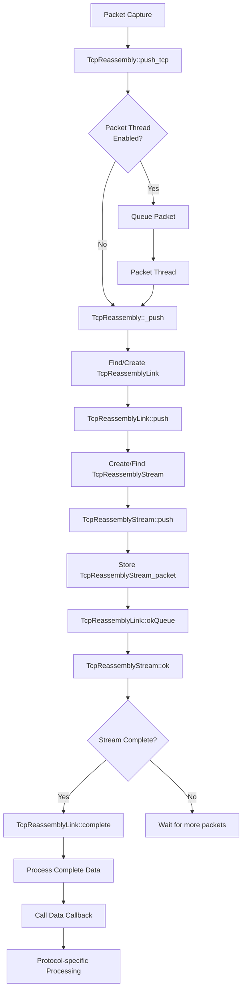
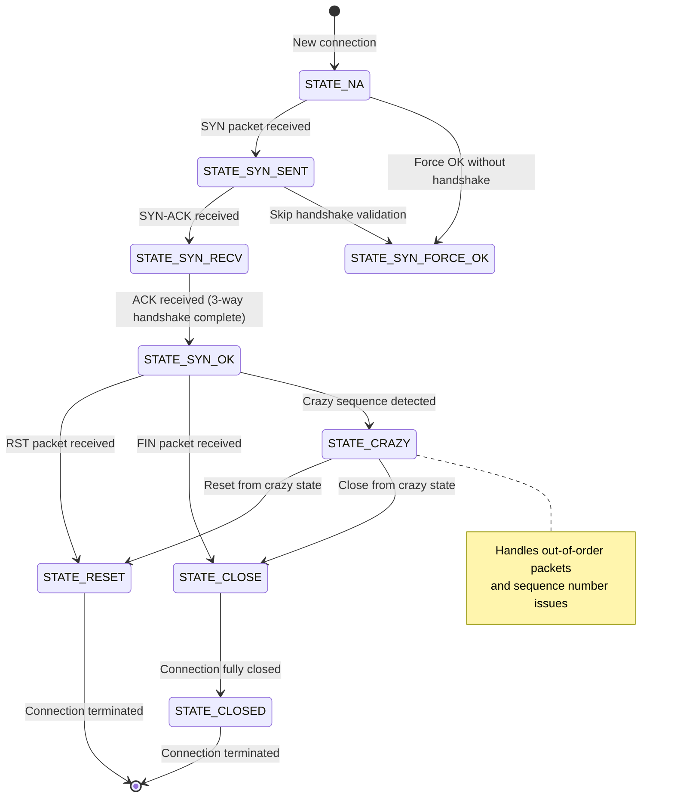
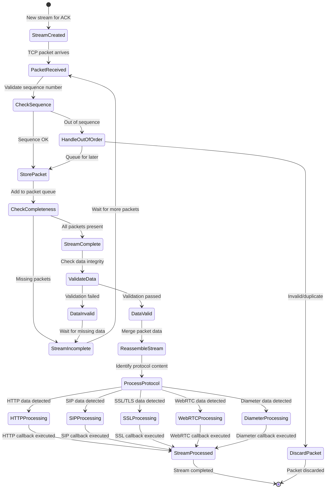
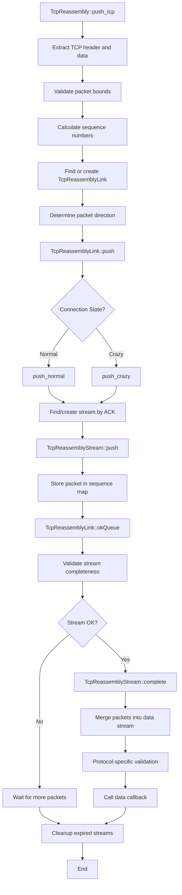
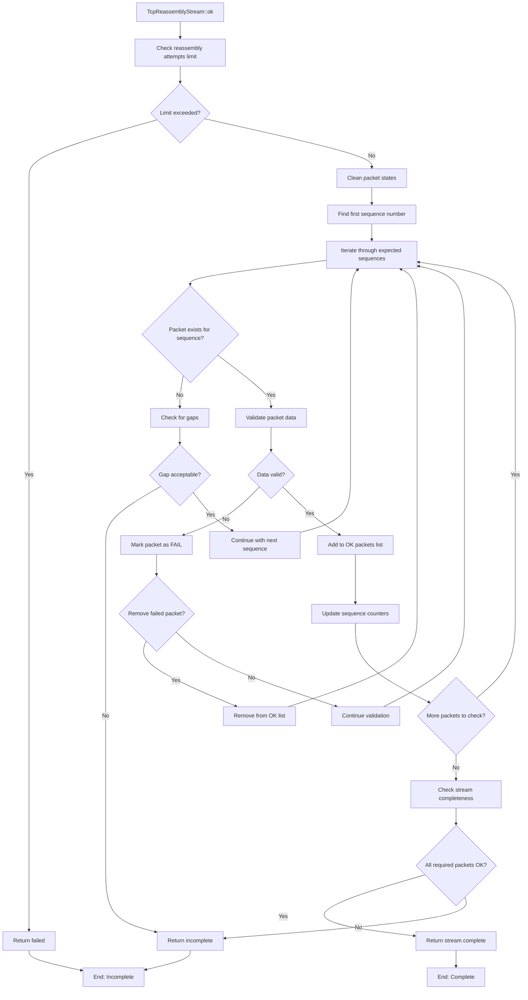
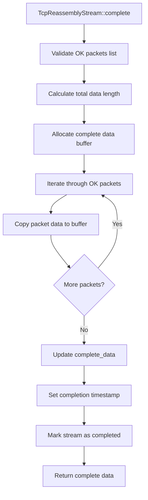
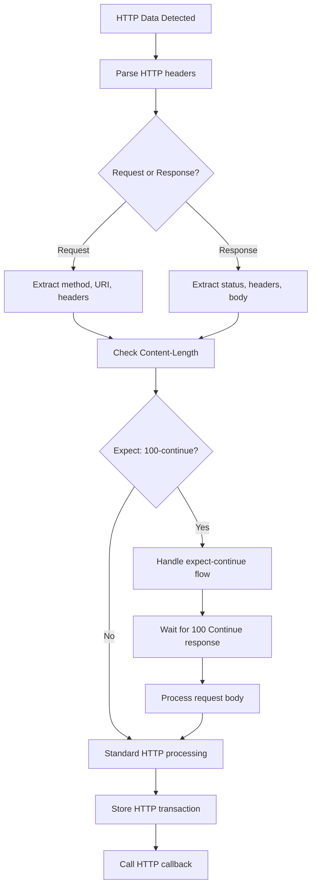
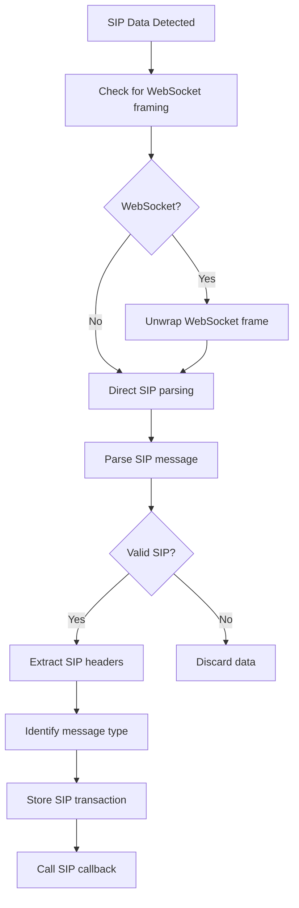
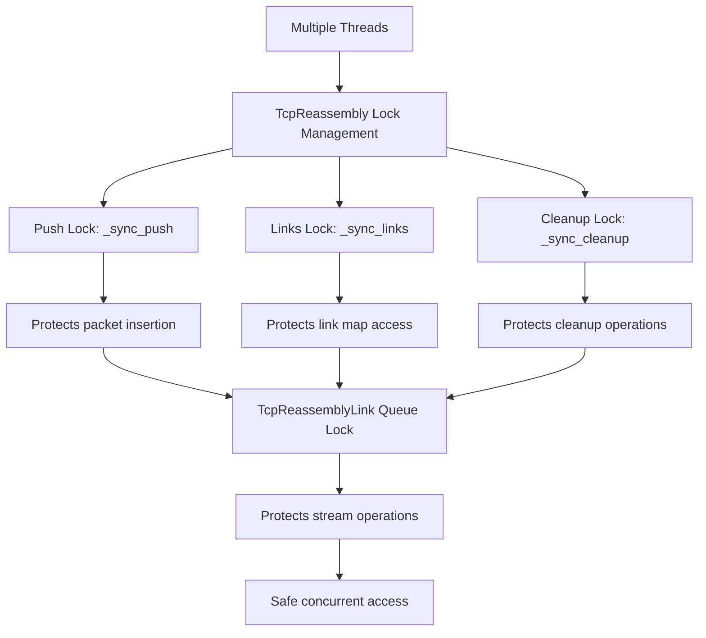
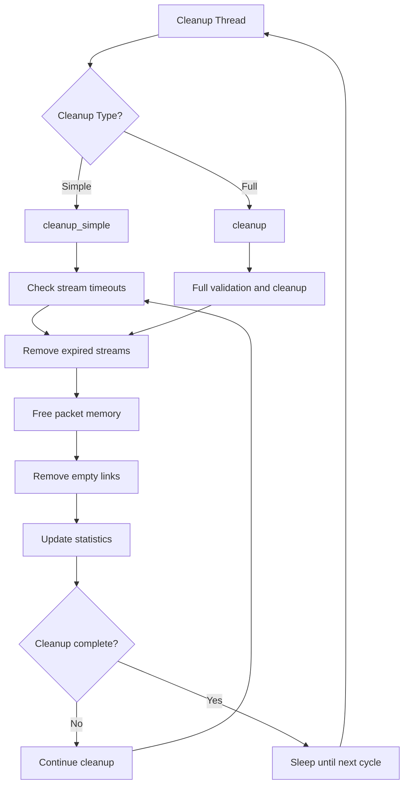

# TCP Reassembly - State and Function Diagram

## Overview
This diagram shows the TCP stream reassembly process in the VoIP monitoring system, primarily implemented in `tcpreassembly.h` and `tcpreassembly.cpp`. The system handles multiple protocol types: HTTP, WebRTC, SSL, SIP, and Diameter.

## TCP Reassembly Architecture Overview



## TCP Link State Machine



## TCP Stream Processing State Machine



## Key Data Structures

### 1. TcpReassemblyLink (Connection)
```cpp
class TcpReassemblyLink {
    vmIP ip_src, ip_dst;                    // Connection endpoints
    vmPort port_src, port_dst;              // Port numbers
    eState state;                           // Connection state
    map<uint32_t, TcpReassemblyStream*> queue_by_ack;  // Streams by ACK
    deque<TcpReassemblyStream*> queueStreams;          // All streams
    bool exists_data;                       // Has actual data
    u_int64_t last_packet_at_from_header;  // Last activity timestamp
};
```

### 2. TcpReassemblyStream (Data Stream)
```cpp
class TcpReassemblyStream {
    eDirection direction;                   // TO_DEST or TO_SOURCE
    u_int32_t ack, first_seq, last_seq;   // Sequence tracking
    map<uint32_t, TcpReassemblyStream_packet_var> queuePacketVars;  // Packets
    bool is_ok;                            // Stream validation status
    TcpReassemblyDataItem complete_data;   // Reassembled data
    eHttpType http_type;                   // HTTP request type
    bool http_ok;                          // HTTP validation
};
```

### 3. TcpReassemblyStream_packet (Individual Packet)
```cpp
class TcpReassemblyStream_packet {
    timeval time;                          // Packet timestamp
    tcphdr2 header_tcp;                   // TCP header
    u_char *data;                         // Packet data
    u_int32_t datalen, datacaplen;        // Data lengths
    eState state;                         // Packet state (NA/CHECK/FAIL)
};
```

## TCP Reassembly Function Flow

### Main Processing Pipeline


### Stream Validation Algorithm


### Data Completion and Merging


## Protocol-Specific Processing

### HTTP Processing


### SIP Processing


## Threading and Concurrency

### Thread Safety Mechanisms


### Cleanup and Memory Management


## Configuration Parameters

### Key Settings
- **linkTimeout**: Connection timeout (default: 2 minutes)
- **maxReassemblyAttempts**: Maximum validation attempts (default: 50)
- **maxStreamLength**: Maximum packets per stream (default: unlimited)
- **cleanupPeriod**: Cleanup interval (default: 20 seconds)
- **enableCrazySequence**: Handle out-of-order packets
- **simpleByAck**: Use simplified ACK-based processing

### Performance Optimizations
- **enablePacketThread**: Separate thread for packet processing
- **enableCleanupThread**: Dedicated cleanup thread
- **enableSmartCompleteData**: Intelligent data completion
- **enableValidateDataViaCheckData**: Protocol-specific validation

## Error Handling and Recovery

### Common Error Scenarios
1. **Sequence gaps**: Handle missing TCP segments
2. **Out-of-order packets**: Reorder using sequence numbers
3. **Duplicate packets**: Detect and discard duplicates
4. **Memory exhaustion**: Cleanup expired connections
5. **Protocol violations**: Validate and recover from malformed data

### Debug and Monitoring
- **Verbose logging**: Detailed packet and stream information
- **Performance statistics**: CPU usage and memory consumption
- **Protocol-specific logs**: HTTP, SIP, SSL transaction logs
- **Packet dumping**: Save problematic packets for analysis