# VoipMonitor System - State Diagrams for All Modules

## Overview
VoipMonitor is a comprehensive VoIP monitoring system that captures, processes, and analyzes VoIP traffic. This document presents state diagrams for all major modules in the system.

## 1. Main System Module (voipmonitor.cpp)

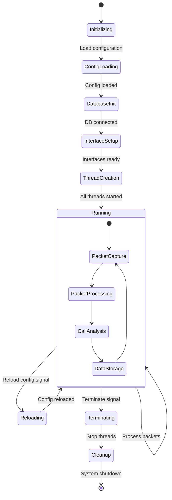

## 2. Call Table Module (calltable.h/cpp)

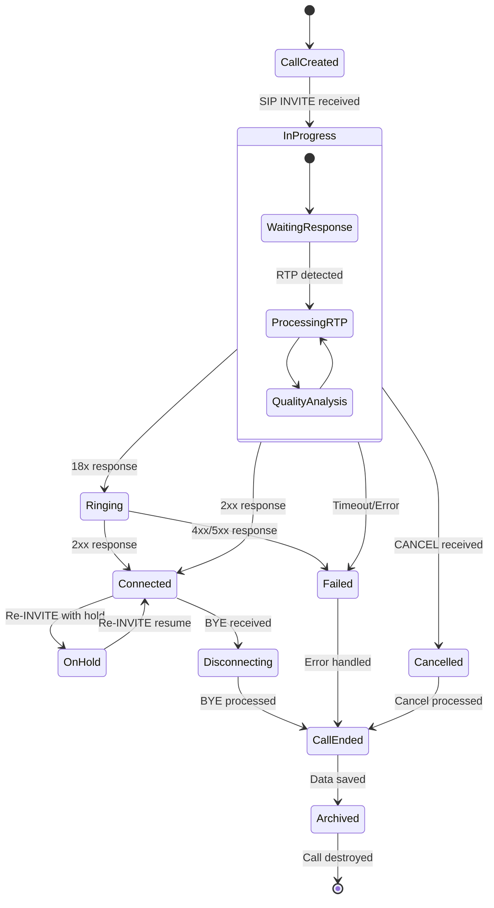

## 3. RTP Processing Module (rtp.h/cpp)

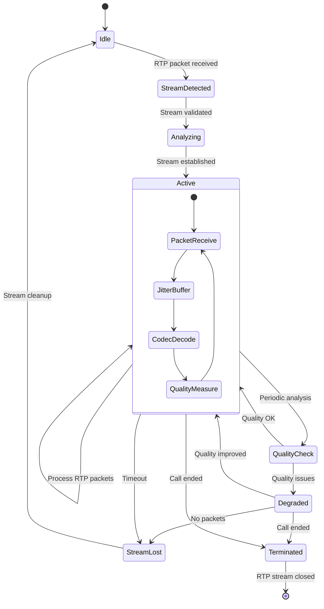

## 4. TCP Reassembly Module (tcpreassembly.h/cpp)

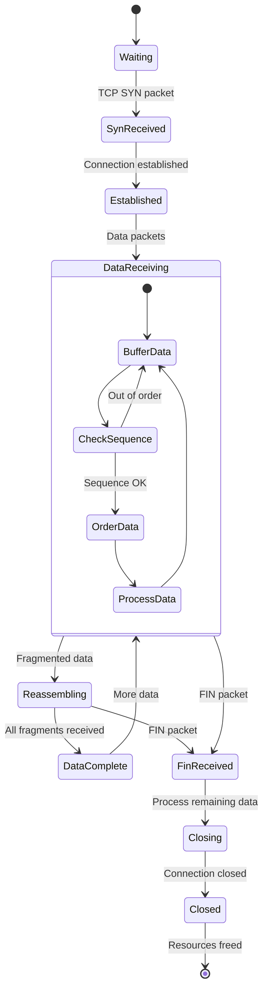

## 5. SIP Registration Module (register.h/cpp)

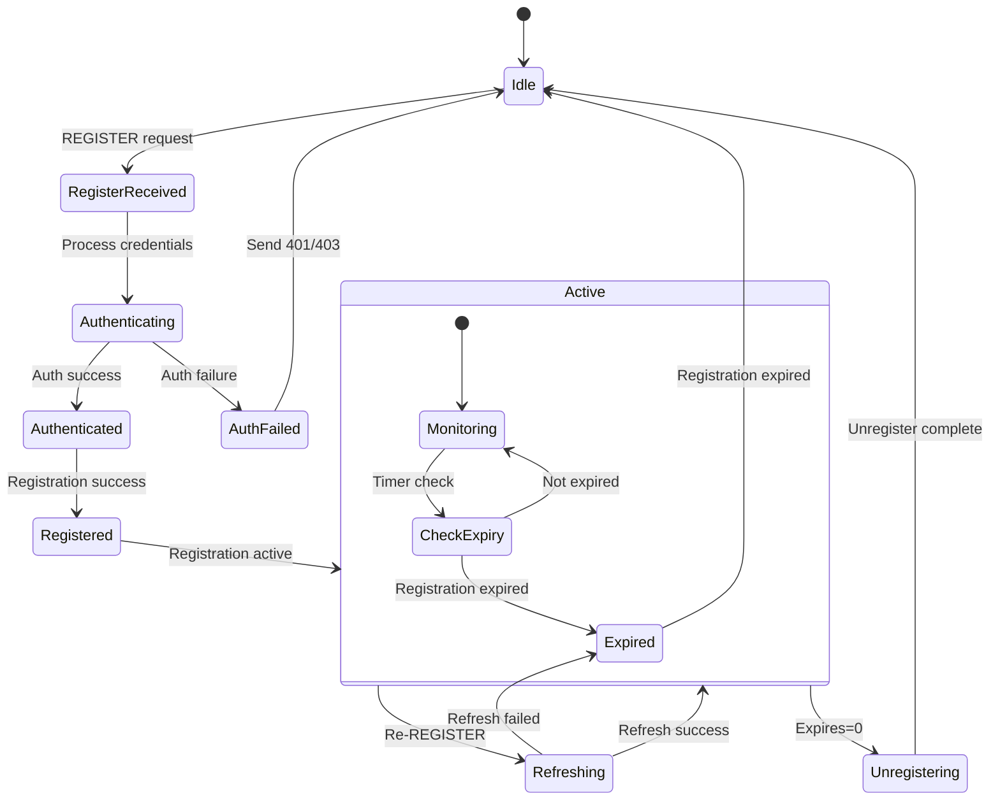

## 6. SSL/TLS Processing Module (ssl.h/cpp)

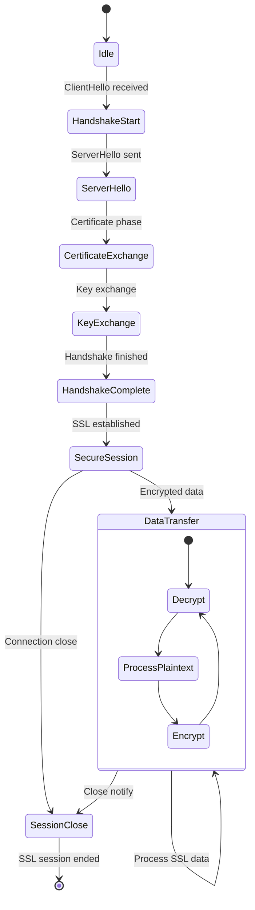

## 7. Database Module (sql_db.h/cpp)

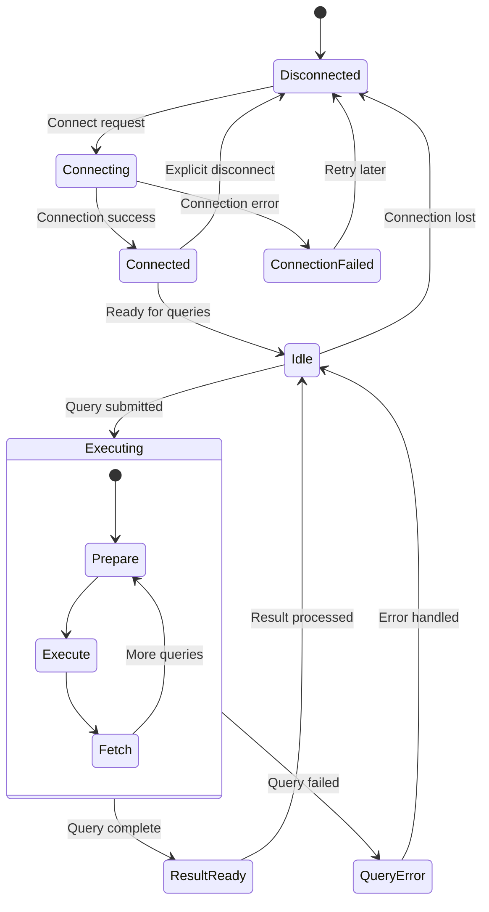

## 8. Packet Capture Module (pcap_queue.h/cpp)

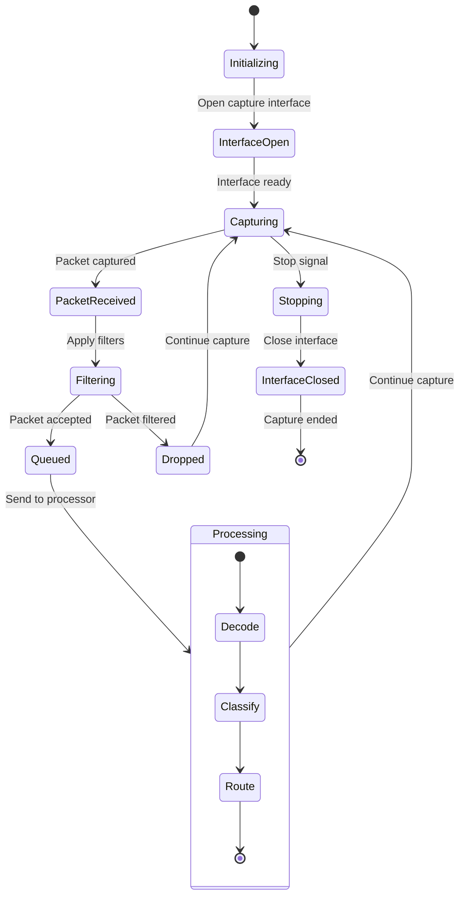

## 9. WebRTC Processing Module (webrtc.h/cpp)

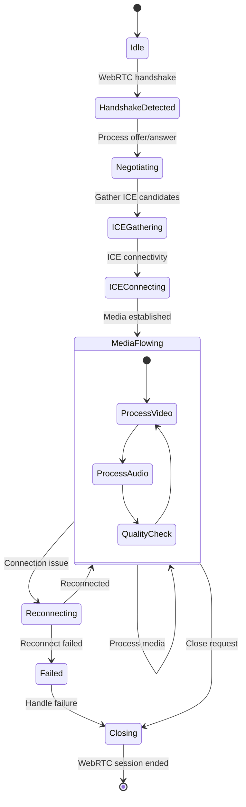

## 10. Billing Module (billing.h/cpp)

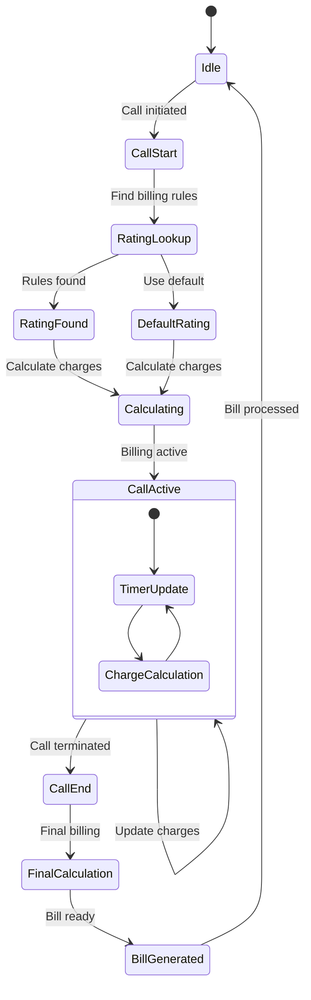

## 11. Configuration Module (config_param.h/cpp)

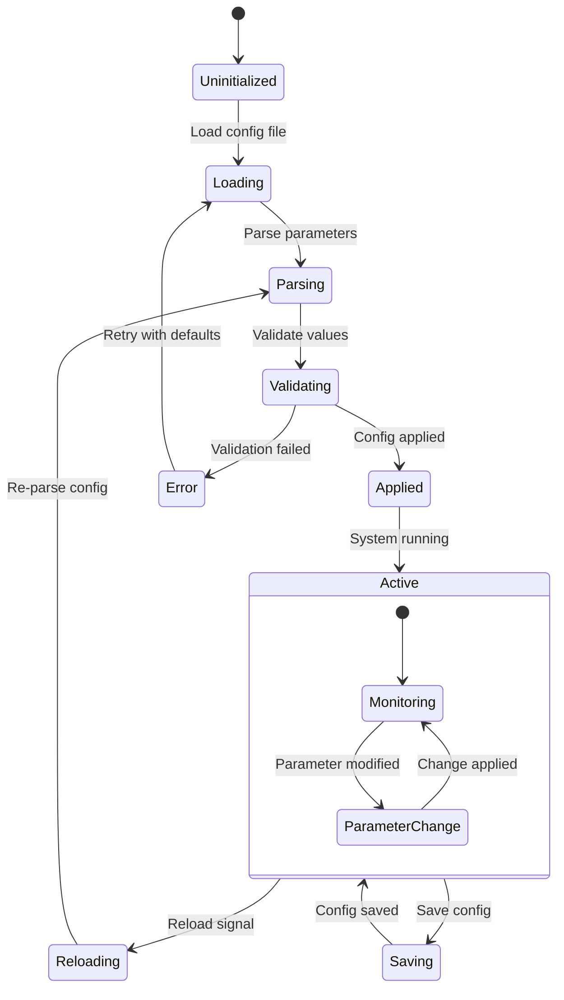

## 12. Audio Processing/DSP Module (dsp.h/cpp)

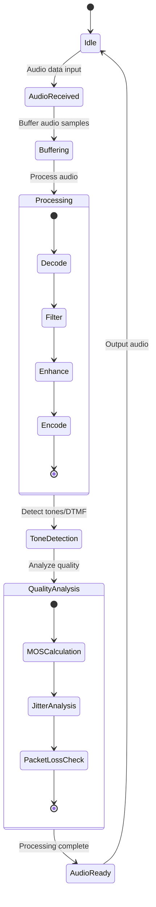

## 13. Transcription Module (transcribe.h/cpp)

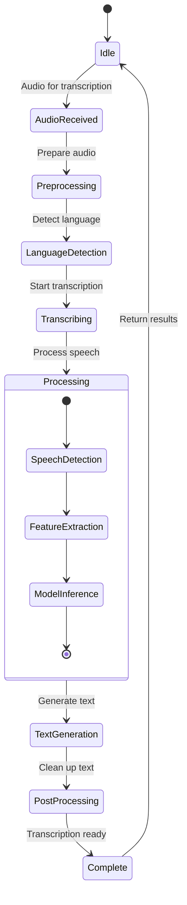

## 14. Charts/Statistics Module (charts.h/cpp)

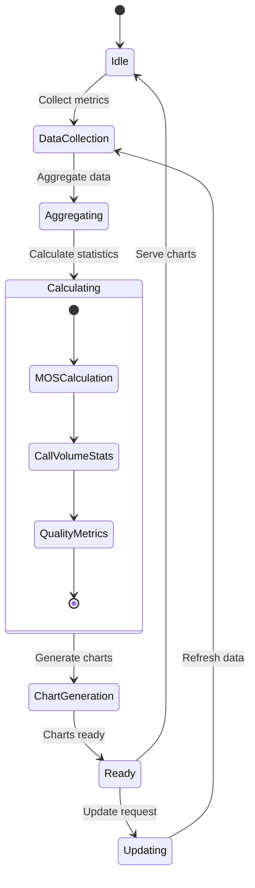

## 15. Country Detection Module (country_detect.h/cpp)

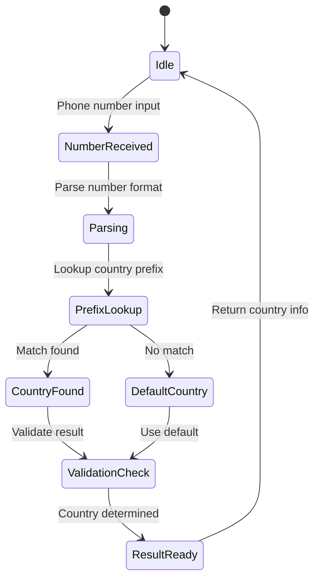

## Module Interaction Overview

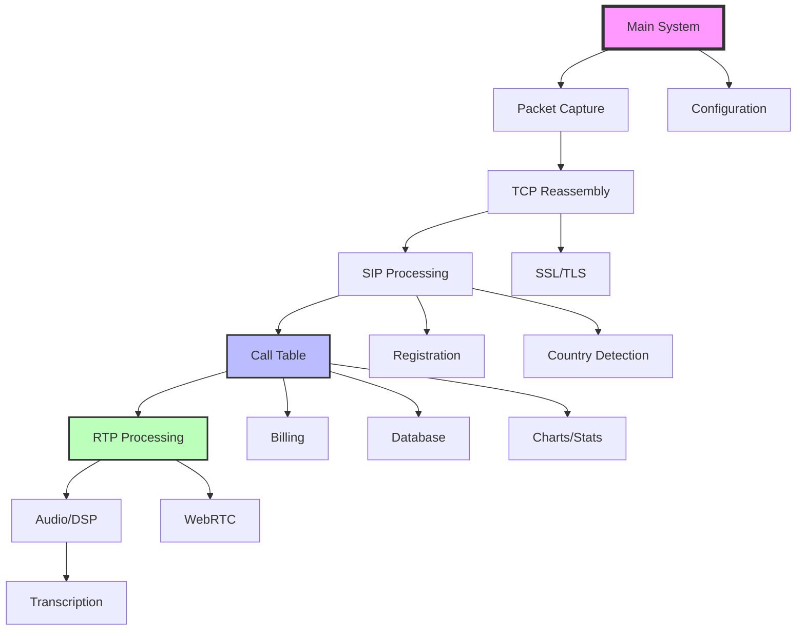

## State Transition Summary

Each module follows a typical lifecycle:
1. **Initialization** - Module setup and resource allocation
2. **Active Processing** - Main operational state with data processing
3. **Error Handling** - Recovery from failures and exceptions  
4. **Cleanup/Termination** - Graceful shutdown and resource deallocation

The system maintains state consistency through:
- Synchronized access to shared resources
- Event-driven state transitions
- Proper error handling and recovery mechanisms
- Resource cleanup on state transitions